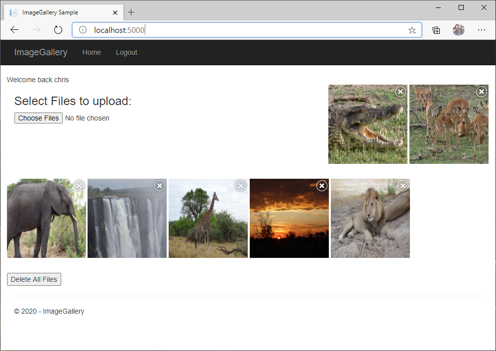
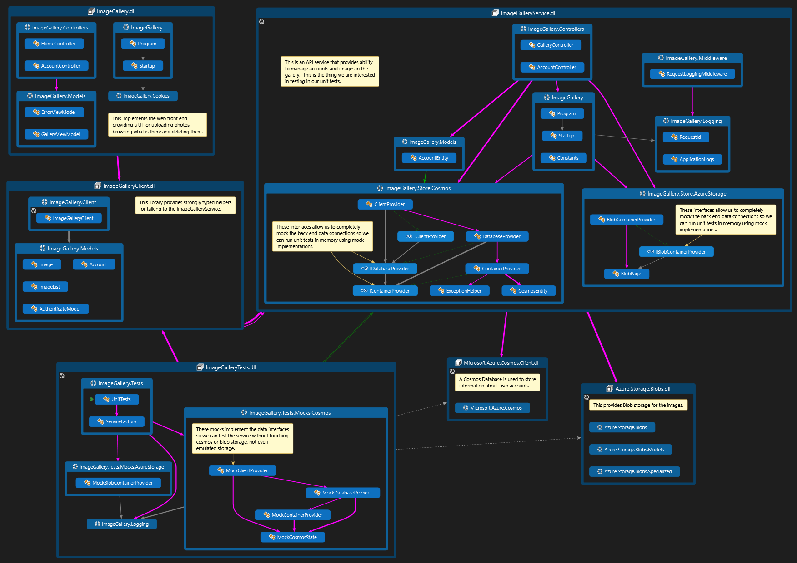

# ImageGallery

This is a web client front end that uses the ImageGalleryService middle tier.



### What you will need

The app depends on the following:

- [.NET 6.0 SDK](https://dotnet.microsoft.com/download/dotnet) must be installed.
- [Azure Storage Emulator](https://docs.microsoft.com/en-us/azure/storage/common/storage-use-emulator) must be hnstalled running.
- [Azure Cosmos Emulator](https://docs.microsoft.com/en-us/azure/cosmos-db/local-emulator?tabs=cli%2Cssl-netstd21) must be installed and running.
- Open Azure Cosmos Data Explorer from taskbar tray and copy the `Primary Connection String` from there into `~/ImageGalleryAspNet/ImageGalleryService/appsettings.json`.

### Running the app

Once the above steps are complete you can run this app do the following from in two separate console windows

```shell
cd  ..\ImageGalleryService
dotnet run
```

And in the second window:

```shell
cd ..\ImageGallery
dotnet run
```

Navigate your web browser to `http://localhost:5000/` and you will see the empty ImageGallery site.

Upload some of your favorite photos (you can do more than one at a time) and you will see them appear.

The "dotnet run" consoles will also show logging output that shows you what is happening behind the scenes.

### Design

