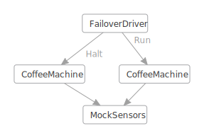
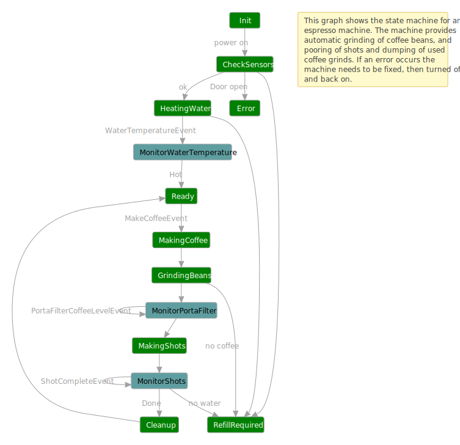

## Failover coffee machine using actors

*Wikipedia* provides this [definition](https://en.wikipedia.org/wiki/Failover): "**Failover** is switching to a
redundant or standby computer server, system, hardware component or network upon the failure or abnormal termination of
the previously active application, server, system, hardware component, or network. Systems designers usually provide
failover capability in servers, systems or networks requiring near-continuous availability and a high degree of
reliability."

This sample applies the failover concept to the firmware of an automated espresso machine using the Coyote [asynchronous
actors](../programming-models/actors/overview) programming model.  Imagine what would happen if the tiny CPU running the
machine rebooted in the middle of making a coffee.  What bad things might happen? Can we design a state machine that can
handle this scenario and provide a more fault tolerant coffee machine?

An identical version of this tutorial is available that uses the coyote [asynchronous
tasks](failover-coffee-machine-tasks) programming model.

The following diagram shows how Coyote can be used to test this scenario and help you design more reliable software.



The `CoffeeMachine` is modeled as an asynchronous [state machine](../programming-models/actors/state-machines). This
example is not providing real firmware, instead it `mocks` the hardware sensor platform built into the machine.  This is
done in the asynchronous `MockSensors` state machine.  This state machine provides async ways of reading sensor values
like Water Temperature and setting things like the power button, or turning on and off the coffee grinder and so on.

The reason we are using an asynchronous model is that even in the smallest of devices, often times there is a message
passing architecture where different hardware components are connected via some sort of bus, whether it is a simple
serial port, or something more sophisticated like a [CAN bus](https://en.wikipedia.org/wiki/CAN_bus).

We will test that we can kill the `CoffeeMachine` and restart it without anything bad happening.  This test is setup by
the `FailoverDriver`.  The FailoverDriver lets the first `CoffeeMachine` instance run for a bit then it randomly kills
it by using the `HaltEvent`, then it starts a new `CoffeeMachine`. The new `CoffeeMachine` instance needs to figure out
the state of the sensors such that when a `MakeCoffeeEvent` arrives, it doesn't do something silly that breaks the
machine. The `MockSensors` class is not killed so that it acts as a persist store for sensor state across all instances
of the `CoffeeMachine`.

Some safety `Asserts` are placed in the code that verify certain important things, including:
- do not turn on heater if there is no water
- do not turn on grinder if there are no beans in the hopper
- do not turn on shot maker if there is no water

There is also a correctness assert in the `CoffeeMachine` to make sure the correct number of espresso shots are made and
there is a `LivenessMonitor` that monitors the `CoffeeMachine` to make sure it never gets stuck, i.e., it always
finishes the job it was given or it goes to an error state if the machine needs to be fixed.  See [Liveness
Checking](../specifications/liveness-checking).

A number of excellent bugs were found by [coyote test](../tools/testing) during the development of this sample, and this
illustrates the fact that Coyote can be applied to any type of asynchronous software, not just cloud services.  There is
still one bug remaining in the code which you can find using `coyote test`, and it happens after failover just to prove
the usefulness of this testing methodology.

## What you will need

To run the `CoffeeMachine` example, you will need to:

- Install [Visual Studio 2019](https://visualstudio.microsoft.com/downloads/).
- Build the [Coyote project](/coyote/learn/get-started/install).
- Clone the [Coyote Samples git repo](http://github.com/microsoft/coyote-samples).

## Build the Sample

Build the `coyote-samples` repo by running the following command:

```
powershell -f build.ps1
```

## Run the Failover Coffee Machine application

Now you can run the `CoffeeMachine` application:
- in .Net Core:

```shell
dotnet ./bin/netcoreapp2.2/CoffeeMachineActors.dll
```

- in .Net 4.6:

```
.\bin\net46\CoffeeMachineActors.exe
```

- in .Net 4.7:

```
.\bin\net47\CoffeeMachineActors.exe
```

## The Coffee Machine

There are many different types of coffee machines.   This example is based on the following machine which can
automatically heat water, grind beans, and make an espresso shot all with the press of a button:


The following diagram shows the states and actions in our example implementation in the `CoffeeMachine` class:



Then you run the executable without using `coyote test` (this is called running in `production mode`), you will see the
following console output.  Notice in the output below that the `FailoverDriver` forces the termination of the
`CoffeeMachine` right in the middle of making a coffee.  Then when the `CoffeeMachine` is restarted, the
`FailoverDriver` requests another coffee and the `CoffeeMachine` is able to continue on, the water is already warm, and
it dumps the old grinds so you have the freshest possible coffee each time.

```xml
<FailoverDriver> starting new CoffeeMachine.
<CoffeeMachine> initializing...
<CoffeeMachine> checking initial state of sensors...
<CoffeeMachine> Water level is 60 %
<CoffeeMachine> Hopper level is 93 %
<CoffeeMachine> Warming the water to 100 degrees
<CoffeeMachine> Turning on the water heater
<CoffeeMachine> Coffee machine is warming up (64 degrees)...
<CoffeeMachine> Coffee machine is warming up (74 degrees)...
<CoffeeMachine> Coffee machine is warming up (84 degrees)...
<CoffeeMachine> Coffee machine is warming up (94 degrees)...
<CoffeeMachine> Coffee machine water temperature is now 100
<CoffeeMachine> Turning off the water heater
<CoffeeMachine> Coffee machine is ready to make coffee (green light is on)
<CoffeeMachine> Coffee requested, shots=1
<CoffeeMachine> Grinding beans...
<CoffeeMachine> PortaFilter is 10 % full
<CoffeeMachine> PortaFilter is 20 % full
<CoffeeMachine> PortaFilter is 30 % full
<CoffeeMachine> PortaFilter is 40 % full
<CoffeeMachine> PortaFilter is 50 % full
<CoffeeMachine> PortaFilter is 60 % full
<CoffeeMachine> PortaFilter is 70 % full
<CoffeeMachine> PortaFilter is 80 % full
<CoffeeMachine> PortaFilter is 90 % full
<CoffeeMachine> PortaFilter is full
<CoffeeMachine> Making shots...
<FailoverDriver> forcing termination of CoffeeMachine.
<CoffeeMachine> Coffee Machine Terminating...
<CoffeeMachine> #################################################################
<CoffeeMachine> # Coffee Machine Halted                                         #
<CoffeeMachine> #################################################################

<FailoverDriver> starting new CoffeeMachine.
<CoffeeMachine> initializing...
<CoffeeMachine> checking initial state of sensors...
<CoffeeMachine> Water level is 60 %
<CoffeeMachine> Hopper level is 83 %
<CoffeeMachine> Dumping old smelly grinds!
<CoffeeMachine> Warming the water to 100 degrees
<CoffeeMachine> Coffee machine water temperature is now 100
<CoffeeMachine> Coffee machine is ready to make coffee (green light is on)
<CoffeeMachine> Coffee requested, shots=2
<CoffeeMachine> Grinding beans...
<CoffeeMachine> PortaFilter is 10 % full
<CoffeeMachine> PortaFilter is 20 % full
<CoffeeMachine> PortaFilter is 30 % full
<CoffeeMachine> PortaFilter is 40 % full
<CoffeeMachine> PortaFilter is 50 % full
<CoffeeMachine> PortaFilter is 60 % full
<CoffeeMachine> PortaFilter is 70 % full
<CoffeeMachine> PortaFilter is 80 % full
<CoffeeMachine> PortaFilter is 90 % full
<CoffeeMachine> PortaFilter is full
<CoffeeMachine> Making shots...
<CoffeeMachine> Shot count is 1
<CoffeeMachine> 2 shots completed and 2 shots requested!
<CoffeeMachine> Dumping the grinds!
<CoffeeMachine> Coffee machine is ready to make coffee (green light is on)
<FailoverDriver> CoffeeMachine completed the job.
...
```

The test will continue on making coffee until it runs out of either water or coffee beans and the `FailoverDriver` halts
each `CoffeeMachine` instance at random times until the machine is out of resources, at which point the test is
complete. The `MockSensors` also randomly choose some error conditions, so instead of the above you may see some errors
like:

```xml
<CoffeeMachine> Cannot safely operate coffee machine with the door open!
<CoffeeMachine> Coffee machine needs manual refilling of water and/or coffee beans!
```

If you see these errors, just press ENTER to terminate the program and run it again. These random start conditions just
help the test cover more cases.

Each halted machine is terminated and discarded then a new `CoffeeMachine` instance is started.  Each new
`CoffeeMachine` instance must figure out what is happening with the sensors and make the next coffee without incident.
Eventually a `CoffeeMachine` will report there is no more water or coffee beans and then it will stop with an error
message saying the machine needs to be manually refilled.

### Coyote Testing

You can now use [coyote test](/coyote/learn/tools/testing) to exercise the code and see if any bugs can be found.
From the `coyote-samples` folder:

```
..\Coyote\bin\net46\coyote.exe test .\bin\net46\CoffeeMachineActors.exe -i 100 -ms 2000 --sch-pct 10 --graph-bug
```

Chances are this will find a bug quickly, one of the safety assertions will fire and you will see that a test output log
and [DGML diagram](../tools/dgml) are produced, like this:

```
.\bin\net46\Output\CoffeeMachineActors.exe\CoyoteOutput\CoffeeMachine_0_0.txt
.\bin\net46\Output\CoffeeMachineActors.exe\CoyoteOutput\CoffeeMachine_0_0.dgml
```

This log can be pretty big, a couple thousand lines where each line represents on async operation. This log contains
only the one iteration that failed, and towards the end you will see something like this:


```
<ActionLog> 'Microsoft.Coyote.Samples.CoffeeMachine.MockSensors(3)' invoked action 'OnGrinderButton'
<ErrorLog> Please do not turn on grinder if there are no beans in the hopper
```

So the `CoffeeMachine` accidentally tried to grind beans when the hopper was empty.  If you look at the resulting
DGML diagram you will see exactly what happened:

<div>



<script language="javascript" src="/coyote/assets/js/animate_trace.js"></script>
<script language="javascript" src="/coyote/assets/js/trace_model.js"></script>

<script language="javascript">

fetchTrace('/coyote/assets/data/CoffeeMachine.trace.xml', convertTrace);

</script>
</div>

The `Timer` machines were removed from this diagram just for simplicity.  The `FailoverDriver` started the first
`CoffeeMachine` on the left which ran to completion but it went to the `RefillRequired` state which means it
detected the coffee beans empty state.  Then this first machine was halted.  The `FailoverDriver` then started a new
`CoffeeMachine`, which made it all the way to `GrindingBeans` where it tripped the saftey assert in `MockSensors`.
So the bug here is that somehow, the second `CoffeeMachine` instance missed the fact that it was low on coffee beans.
A bug exists in the code somewhere.  Can you find it?

It is not a trivial bug because the `CheckSensors` state is clearly checking the coffee level by sending the
`ReadHopperLevelEvent` to the `MockSensors` actor and `CheckInitialState` does not advance to the `HeatingWater`
state until this reading is returned.  So what happened?

Hint: if you search backwards in the output log you will find the following situation reported in `CheckState`:
```
<CoffeeMachine> Hopper level is -5 %
```

The first `CoffeeMachine` instance left the grinder running a bit too long, and the sensor got confused thinking the
coffee level is negative.  The new `CoffeeMachine` instance never thought about this situation and checked only:
```
if ((int)this.HopperLevel.Value == 0)
...
```

And so it missed the fact it might be negative.  The fix is easy, just change this condition to `<=` and the bug goes
away.   The fact that such a tricky bug was found so quickly shows the power of using the Coyote state machine
programming model together with the `coyote test` tool.

### Testing the Scheduling of Highly Asynchronous Operations

This raises a bigger design question, how did the coffee level become negative?  In firmware it is common to poll sensor
readings and do something based on that.  In this case we are polling a `PortaFilterCoffeeLevelEvent` in a tight loop
while in the `GrindingBeans` state.  Meanwhile the `MockSensors` class has a
[timer](../programming-models/actors/timers) running and when `HandleTimer` calls `MonitorGrinder` it decreases the
coffee level by 10 percent during every time interval.  So we have a very asynchronous operation going on here. Coffee
level is decreasing based on a timer, and the `CoffeeMachine` is monitoring that coffee level using async events.  This
all seems to work perfectly in the production code where we see this output:

```
<CoffeeMachine> Grinding beans...
<CoffeeMachine> PortaFilter is 10 % full
<CoffeeMachine> PortaFilter is 20 % full
<CoffeeMachine> PortaFilter is 30 % full
<CoffeeMachine> PortaFilter is 40 % full
<CoffeeMachine> PortaFilter is 50 % full
<CoffeeMachine> PortaFilter is 60 % full
<CoffeeMachine> PortaFilter is 70 % full
<CoffeeMachine> PortaFilter is 80 % full
<CoffeeMachine> PortaFilter is 90 % full
<CoffeeMachine> PortaFilter is full
```

And the reason it works is because your Operating System is scheduling both of these async threads in a way that is
relatively `fair` meaning one does not run for a long time without the other being scheduled also. But what if these two
systems were running in a distributed world and one of them hangs for a long time? This is the kind of thread scheduling
that `coyote test` is testing where one machine can run way ahead of another.

You need to take this into account when using this kind of [timer based async
events](../programming-models/actors/timers).  One way to improve the design in a firmware based system like a coffee
machine is to switch from a polling based system to an interrupt based system where the `MockSensors` can send important
events to the `CoffeeMachine`.  This style of `interrupt` based eventing is used to model the `ShotCompleteEvent`,
`WaterHotEvent`, `WaterEmptyEvent` and `HopperEmptyEvent`.

This shows how Coyote can help find actual design flaws in your code so you can design a system that is more robust in
the face of unexpected faults.  The `coyote test` engine provides several different `scheduling strategies` that test
different kinds of fairness algorithms. These are designed to find different kinds of bugs.  The following command line
shows how to use `--sch-portfolio` and the `--parallel` options to test a bunch of different strategies in parallel,
each in different test processes:

```
d:\git\foundry99\CoyoteSamples>..\Coyote\bin\net46\coyote.exe test D:\git\foundry99\CoyoteSamples\bin\net46\CoffeeMachineActors.exe -i 100 -ms 2000 --sch-pct 10 --graph-bug --sch-portfolio --parallel 8
. Testing D:\git\foundry99\CoyoteSamples\bin\net46\CoffeeMachineActors.exe
Starting TestingProcessScheduler in process 42036
Launching d:\git\foundry99\Coyote\bin\net46\coyote.exe
Launching d:\git\foundry99\Coyote\bin\net46\coyote.exe
Launching d:\git\foundry99\Coyote\bin\net46\coyote.exe
Launching d:\git\foundry99\Coyote\bin\net46\coyote.exe
Launching d:\git\foundry99\Coyote\bin\net46\coyote.exe
Launching d:\git\foundry99\Coyote\bin\net46\coyote.exe
Launching d:\git\foundry99\Coyote\bin\net46\coyote.exe
Launching d:\git\foundry99\Coyote\bin\net46\coyote.exe
... Created '8' testing tasks.
... Task 3 is using 'FairPCT' strategy (seed:2143).
... Task 5 is using 'FairPCT' strategy (seed:3489).
... Task 2 is using 'ProbabilisticRandom' strategy (seed:1470).
... Task 7 is using 'FairPCT' strategy (seed:4835).
... Task 0 is using 'Random' strategy (seed:124).
... Task 6 is using 'ProbabilisticRandom' strategy (seed:4162).
... Task 4 is using 'ProbabilisticRandom' strategy (seed:2816).
... Task 1 is using 'FairPCT' strategy (seed:797).
...
...
```

The `--parallel 8` option means use 8 test processes in parallel, each one is assigned a random scheduling strategy.
Each process runs until the first one finds a bug, then they are all terminated and the bug is reported. This can be
useful when you want to leverage the full power of your PC to find those bugs that are particularly hard to find more
quickly.

You can find out how much testing was actually done during this parallel test operation by adding
`--coverage activity`.  The [coverage report](../tools/coverage) summarizes how many of the possible
events were covered.

### Liveness Monitor

As described in the documentation on [Liveness Checking](../specifications/liveness-checking) the `CoffeeMachine` must
also eventually `finish` what it is doing. It must either make a coffee when requested and return to the `Ready` state,
or it must find a problem and go to the `Error` state or the `RefillRequired` state. This "liveness" property can be
enforced using a very simple `LivenessMonitor` as shown below:

```c#
internal class LivenessMonitor : Monitor
{
    public class BusyEvent : Event { }

    public class IdleEvent : Event { }

    [Start]
    [Cold]
    [OnEventGotoState(typeof(BusyEvent), typeof(Busy))]
    [IgnoreEvents(typeof(IdleEvent))]
    private class Idle : State { }

    [Hot]
    [OnEventGotoState(typeof(IdleEvent), typeof(Idle))]
    [IgnoreEvents(typeof(BusyEvent))]
    private class Busy : State { }
}
```

This type of `Monitor` is also a kind of state machine. The `CoffeeMachine` can send events to this monitor to tell it
when it has switched into `Busy` state or `Idle` state. When the `CoffeeMachine` starts heating water, or making coffee
it sends this event:

```c#
this.Monitor<LivenessMonitor>(new LivenessMonitor.BusyEvent());
```

and when the CoffeeMachine is done making coffee or it has moved to an error state it sends this event:

```c#
this.Monitor<LivenessMonitor>(new LivenessMonitor.IdleEvent());
```

The `Busy` state is marked as a `[Hot]` state and the `Idle` state is marked as a `[Cold]` state.
During testing if `coyote test` finds the `LivenessMonitor` to be stuck in the `[Hot]` state
too long it raises an exception and the test fails.

### Reliable Termination Handshake

You may notice in the code that when the `FailoverDriver` wants to stop the first `CoffeeMachine` it sends a
`CoffeeMachine.TerminateEvent` and waits for a `CoffeeMachine.HaltedEvent` before it starts a new `CoffeeMachine` by
running `this.GotoState<Test>()`.

This may seem a bit convoluted compared to just `this.SendEvent(this.CoffeeMachineId, HaltEvent.Instance)` followed by
`this.GotoState<Test>()`.  The reason a direct halt event was not used in this case is that `Halt` events are processed
asynchronously, which means the `RaiseGotoStateEvent` would end up creating the new `CoffeeMachine` instance before the
old one was fully halted.  This can lead to confusion in the `MockSensors` class which was written to expect one and
only one client `CoffeeMachine` at a time.  The `TerminateEvent` handshake solves that problem.

Since the `TerminateEvent` could be sent to the `CoffeeMachine` at any time we need an easy way to handle this event in
`CoffeeMachine`, hopefully without having to decorate every single state in the machine with the custom attribute:

```c#
[OnEventDoAction(typeof(TerminateEvent), nameof(OnTerminate))]
```

The solution is to handle this event in the `Start` state `Init` then use `RaisePushStateEvent` from `Init` to the next
state. This leaves the `Init` state in the active mode where it can always handle the `TerminateEvent`.

## Summary

Failover testing is simple to achieve using Coyote and yields many interesting bugs in your code, including some thought
provoking design bugs.  The technique of halting your "production" actors/state-machines, and recreating them by reading
from a "persistent" mock (which is not halted during testing) can be generalized to many other scenarios (e.g. cloud
services) where someone needs to test failover logic of production actors using Coyote.

In this tutorial you learned:

- How to do failover testing using Coyote `FailoverDriver` state machines.
- How to use Coyote in a firmware/sensor scenario.
- How to use `--sch-portfolio` testing on multiple processes to find tricky bugs more quickly.
- How `Assert` helps find violations of safety properties during testing.
- How to ensure full termination of one state machine before creating a new one.
- How to use `RaisePushStateEvent` to achieve additional simplicity in handling common events in one place.
- How to write a `LivenessMonitor`.
