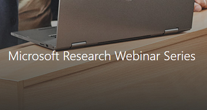

## Webinar

This is an 1 hour Microsoft Research Webinar on Coyote. Sign up to watch the video and you will receive a link to the video in email:

## The async tasks programming model

This Channel 9 On-NET show is a deeper dive into the [async tasks programming model](../programming-models/async/overview.md):

## The actor programming model

This Channel 9 On-NET show is a deeper dive into the [actor programming model](../programming-models/actors/overview.md):

