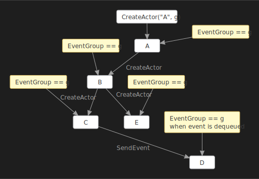

## Event groups

For some applications, it is useful to know which actor is processing an event derived from some
user request. Coyote offers the notion of an _EventGroup_ that can be tracked automatically. The
following `IActorRuntime` APIs take an optional `EventGroup` parameter.

```c#
ActorId CreateActor(Type type, Event e = null, EventGroup group = null);
void SendEvent(ActorId target, Event e, EventGroup group = null);
```

When you pass a non-null group the runtime takes care of propagating it to any subsequent actors
that might be created and across any `SendEvent` calls to any other actors. So all the work
performed as a result of these actors and events can be grouped into a logical group.

The `EventGroup` argument on `SendEvent` is optional, the value `null` means pick up the
`CurrentEventGroup` of the sender and pass it along to the target actor (if there is one).

The `Actor` class has a field that returns the current `EventGroup`. The `EventGroup` is stored
with the event and `CurrentEventGroup` is set when the event is dequeued.

```c#
EventGroup CurrentEventGroup { get; set; }
```

Additionally you may use the following `IActorRuntime` API to get the current group of any actor.

```c#
EventGroup GetCurrentEventGroup(ActorId actorId);
```

The `CurrentEventGroup` is automatically passed along whenever you use `CreateActor` or `SendEvent`
as shown below:



### EventGroup

The base `EventGroup` class contains the following:

```c#
public Guid Id { get; internal set; }
public string Name { get; internal set; }
```

The `Guid` is automatically assigned to `Guid.Empty`. The `Name` defaults to null but you can
provide any friendly name you want there.

### AwaitableEventGroup<<T>>

As a convenience the following typed EventGroup is also provided that can also be used to wait for
some result to be returned from the actors that share this group:

```c#
public class AwaitableEventGroup<T> : EventGroup
{
    public bool IsCompleted { get; }
    public Task<T> Task { get; }
    public virtual void SetResult(T result);
    public TaskAwaiter<T> GetAwaiter();
}
```

You can pass this group to your actors so that one of those actors can decide at some point to call
`SetResult`. Then you can `await` on this object for the result. In this way you can asynchronously
return a result from a collection of actors that are performing some job. `SetResult` also sets
`IsCompleted` to true.

### Clearing the CurrentEventGroup

You might need to clear the current event group at some point in your `Actor`. To do this you can
simply set the property to null:

```c#
this.CurrentEventGroup = null;
```

However, this could be overridden by any subsequent event that is dequeued from the event queue. If
you do not want the `CurrentEventGroup` to be passed along to the target actor you can pass a
special `EventGroup.Null` event group like this:

```c#
this.SendEvent(target, e, EventGroup.Null);
```

This will put a `null` in the event queue of the target actor so that when this event is dequeued
the `CurrentEventGroup` of the target actor will be set to `null`.  In this way then you can propagate
a null `EventGroup` to all your actors.

### Custom EventGroups

The `EventGroup` class is unsealed so you can create any custom class that you need. The following
is an example that counts a certain number of steps before completing the boolean
`AwaitableEventGroup`:

```c#
public class EventGroupCounter : AwaitableEventGroup<bool>
{
    public int ExpectedCount;

    public EventGroupCounter(int expected)
    {
        this.ExpectedCount = expected;
    }

    public void Complete()
    {
        var count = Interlocked.Decrement(ref this.ExpectedCount);
        if (count == 0)
        {
            this.SetResult(true);
        }
    }
}
```

This way you can have multiple actors calling `Complete` and the outer code that is waiting is not
released until the expected count is reached.

Similarly you can create an `EventGroup` that gathers multiple results from various actors like this:

```c#
public class EventGroupList : AwaitableEventGroup<List<string>>
{
    public List<string> Items = new List<string>();

    public void AddItem(string msg)
    {
        this.Items.Add(msg);
    }

    public void Complete()
    {
        this.SetResult(Items);
    }
}
```

Then when the final actor calls `Complete()` the list of gathered items is then made available to the
waiting caller via `SetResult`.
