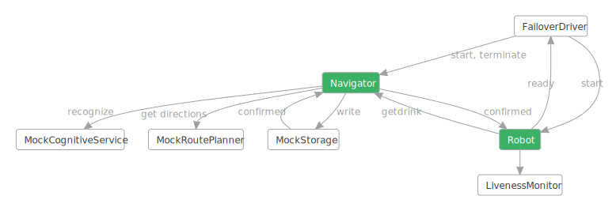

## Failover robot navigator service with actors

*Wikipedia* provides this [definition](https://en.wikipedia.org/wiki/Failover): "**Failover** is
switching to a redundant or standby computer server, system, hardware component or network upon the
failure or abnormal termination of the previously active application, server, system, hardware
component, or network. Systems designers usually provide failover capability in servers, systems or
networks requiring near-continuous availability and a high degree of reliability."

This sample implements a failover scenario in a system where **an instance of a service is
terminated and replaced by a new one**, unlike the [Failover Coffee Machine
sample](../../tutorials/actors/test-failover.md), which is about applying the
failover concept to the firmware of an automated espresso machine.

In this scenario there is a `Robot` that must serve drinks to people in a room:


 1. Before starting to serve the next client the `Robot` is always at an `InitialLocation` in the
    room.

 2. In order to do its job the `Robot` needs the help of a service called the `Navigator`, which
    when provided with the latest picture of the room, finds a person who needs to be served next
    and sends the details (adult or minor, location) of that person to the `Robot`.

 3. It is not always possible to follow the straight line connecting the `Robot`'s location with
    that of the selected client as there are obstacles, like furniture, in the room. Thus, the
    `Robot` asks the `Navigator` to produce a collision-free route from the `Robot`'s location to
    the person who will be served. The `Navigator` provides the requested route that must be
    reached, with the last being that of the client. A route is simply a list of consecutive
    straight line segments.

 4. The `Robot` traverses the route and reaches the client. Then the `Robot` selects randomly an
    appropriate drink for the client: alcoholic for an adult and non-alcoholic for a minor client.

 5. The `Robot` pours a glass of the selected drink for the client and retreats to its
    `InitialLocation`.

The steps 1 to 5 above are repeated continuously.

To make this a failover test, at random times the `Navigator` is killed and a new `Navigator` is
created to replace the old one. When this happens it is required that the system will continue to
operate flawlessly: no data (request or response) between the `Robot` and a `Navigator` will be
lost, and the `Robot` will not stop doing its job.

The following diagram depicts the Failover workflow in this sample:




Do note:
 1. This is a general diagram that can be used not only in this scenario, but for any other
    scenarios involving a robot that operates with the help of object recognition and route
    planning.
 2. The green nodes represent the product code we are testing here, and everything else is mock test
    infrastructure. The main goal is to show the use of `coyote test` in finding concurrency issues
    even at the design stage when the actual implementation hasn't started. For this reason we've
    only provided mock implementations of the cognitive service, the route planner, and the storage
    service. The `Navigator` doesn't know these are mock implementations.
 3. The sample uses the _FailoverDriver_ component to perform the termination of the _Navigator_ and
    the creation of a new _Navigator_. Also a `MockStorage` component is used to store the state
    needed to restart the newly-created instance without loss of state.

The `Robot` and the `Navigator` are modeled as  [state
machines](../../concepts/actors/state-machines.md) and they are started by another state machine
called `FailoverDriver`.

The FailoverDriver lets the first `Navigator` instance run for a bit then it randomly kills it by
sending it the `TerminateEvent`, then it starts a new `Navigator`. The new `Navigator` instance
needs to figure out the state of any previous request: was the prior `Navigator` killed while having
an incompletely processed request from the `Robot` or not? To be able to do so the `Navigator`
stores any newly received request from the `Robot` in the `MockStorage` where it remains until the
request is completely processed and the response is sent to the `Robot` and at that moment the
`Navigator` deletes the pending request record from the `MockStorage`. Note that this is going one
step further than the Coffee Machine example. In this example, not only are we testing that the
Navigator can restart successfully, but we are also testing that the Robot is also able to handle
that failover condition.  The following diagram shows the overall plan where Navigator2 is able
to complete the request started by Navigator1:


The `MockStorage` is an `Actor` that provides simple key-value storage for persisting data and its
instance lives across all instances of the `Navigator`. MockStorage makes `Navigator` failover
possible. The `MockStorage` component, as its name implies, is a mock of a real-world service that
provides similar storage capabilities.

Likewise, the `MockCognitiveService` and `MockRoutePlanner` are mocks of real-world services
providing cognitive services (such as object identification) and motion-path planning.

Some safety `Asserts` are placed in the code that verify certain important things, including:
- on reaching the client the `Robot`'s coordinates must be the same as the client's.
- the key retrieved from the `MockStorage` when requesting a read for a saved `Robot`'s request is
  an expected non-null string.
- the `Navigator` checks that after `MockStorage` performs a write operation to save a `Robot`'s
  request this has not overwritten another existing value for the same storage key. This ensures a
  request from the Robot is not lost.
- all required non-null parameters for `MockStorage` operations (such as `key` or `requestorId`) are
  indeed non-null.

There is a `LivenessMonitor` that monitors the execution of the system to make sure it never gets
stuck, i.e., the `Robot` always gets a valid response to any of its requests from the `Navigator`
and serves the selected client. See [Liveness Checking](../../how-to/liveness-checking.md).

A number of excellent bugs were found by Coyote during the development of this sample, and this
illustrates the fact that Coyote can be applied to find bugs quickly, even in the design stage,
before coding and pushing to production.

## What you will need

To run the `DrinksServingRobotActors` example, you will need to:

- Install [Visual Studio 2022](https://visualstudio.microsoft.com/downloads/).
- Install the [.NET 7.0 version of the coyote tool](../../get-started/install.md).
- Be familiar with the `coyote` tool. See [using Coyote](../../get-started/using-coyote.md).
- Clone the [Coyote git repo](http://github.com/microsoft/coyote).

## Build the sample

You can build the sample by following the instructions
[here](https://github.com/microsoft/coyote/tree/main/Samples/README.md).

## Running and testing the Drink Serving Robot

Now you can run the `DrinksServingRobotActors` application:

```plain
./Samples/bin/net8.0/DrinksServingRobotActors.exe
```

When you run the executable like this without using `coyote test` (this is called running in
_production mode_), you will get infinite console output, that you can to terminate by pressing
ENTER, similar to this:

```xml
<FailoverDriver> #################################################################
<FailoverDriver> Starting the Robot.
<CognitiveService> CognitiveService is starting.
<Navigator> Navigator starting
<Navigator> Got RobotId
<Robot> Obtained a Room Picture at 2/11/2020 6:21:35 PM UTC
<Robot> Asked for a new Drink Order
<Navigator> There was no prior pending request to find drink clients ...
<FailoverDriver> #################################################################
<FailoverDriver> #       Starting the fail over of the Navigator                 #
<FailoverDriver> #################################################################
<Navigator> Terminating as previously ordered ...
<Navigator> Sent Termination Confirmation to my Creator ...
<Navigator> Halting now ...
<FailoverDriver> *****  The Navigator confirmed that it has terminated *****
<FailoverDriver> *****   Created a new Navigator -- paused *****
<FailoverDriver> *****   Waking up the new Navigator *****
<CognitiveService> CognitiveService is starting.
<Navigator> Navigator starting
<Navigator> Got RobotId
<Navigator> Restarting the pending Robot's request to find drink clients ...
<Robot> received a new Navigator, and pending drink order=True!!!
<FailoverDriver> *****   Robot confirmed it reset to the new Navigator *****
<Robot> Received new Drink Order. Executing ...
<Robot> Asked for driving instructions from ( 1, 1 ) to ( 26, 16 )
<Navigator> drink order is complete, deleting the job record.
<Robot> Moving from ( 1, 1 ) to ( 26, 16 )
<Robot> Reached Client.
<Robot> Serving order
<Robot> Selected "WaterMelonLemonade" for Minor client
<Robot> Filled a new glass of WaterMelonLemonade to 100% level
<Robot> Finished serving the order. Retreating.
==================================================

<Robot> Moving from ( 26, 16 ) to ( 1, 1 )
<Robot> Obtained a Room Picture at 2/11/2020 6:21:40 PM UTC
<Robot> Asked for a new Drink Order
<FailoverDriver> #################################################################
<FailoverDriver> #       Starting the fail over of the Navigator                 #
<FailoverDriver> #################################################################
<Navigator> Terminating as previously ordered ...
<Navigator> Sent Termination Confirmation to my Creator ...
<Navigator> Halting now ...
<FailoverDriver> *****  The Navigator confirmed that it has terminated *****
<FailoverDriver> *****   Created a new Navigator -- paused *****
<CognitiveService> CognitiveService is starting.
<FailoverDriver> *****   Waking up the new Navigator *****
<Navigator> Navigator starting
<Navigator> Got RobotId
<Robot> received a new Navigator, and pending drink order=True!!!
<Navigator> Restarting the pending Robot's request to find drink clients ...
<FailoverDriver> *****   Robot confirmed it reset to the new Navigator *****
<Robot> Received new Drink Order. Executing ...
<Robot> Asked for driving instructions from ( 1, 1 ) to ( 14, 4 )
<Navigator> drink order is complete, deleting the job record.
<Robot> Moving from ( 1, 1 ) to ( 6, 23 )
<Robot> Moving from ( 6, 23 ) to ( 14, 4 )
<Robot> Reached Client.
<Robot> Serving order
<Robot> Selected "Sprite" for Minor client
<Robot> Filled a new glass of Sprite to 100% level
<Robot> Finished serving the order. Retreating.
==================================================

<Robot> Moving from ( 14, 4 ) to ( 1, 1 )
<Robot> Obtained a Room Picture at 2/11/2020 6:21:45 PM UTC
<Robot> Asked for a new Drink Order
<FailoverDriver> #################################################################
<FailoverDriver> #       Starting the fail over of the Navigator                 #
<FailoverDriver> #################################################################
<Navigator> Terminating as previously ordered ...
<Navigator> Sent Termination Confirmation to my Creator ...
<Navigator> Halting now ...
<FailoverDriver> *****  The Navigator confirmed that it has terminated *****
<FailoverDriver> *****   Created a new Navigator -- paused *****
<CognitiveService> CognitiveService is starting.
<FailoverDriver> *****   Waking up the new Navigator *****
<Navigator> Navigator starting
<Navigator> Got RobotId
<Robot> received a new Navigator, and pending drink order=True!!!
<Navigator> Restarting the pending Robot's request to find drink clients ...
<FailoverDriver> *****   Robot confirmed it reset to the new Navigator *****
<Robot> Received new Drink Order. Executing ...
<Robot> Asked for driving instructions from ( 1, 1 ) to ( 25, 17 )
<Navigator> drink order is complete, deleting the job record.
<Robot> Moving from ( 1, 1 ) to ( 2, 4 )
<Robot> Moving from ( 2, 4 ) to ( 25, 17 )
<Robot> Reached Client.
<Robot> Serving order
<Robot> Selected "Water" for Minor client
<Robot> Filled a new glass of Water to 100% level
<Robot> Finished serving the order. Retreating.
==================================================

<Robot> Moving from ( 25, 17 ) to ( 1, 1 )
```

You can leave this running and you will see the `FailoverDriver` halting a `Navigator` instance at
random times. Each halted machine is terminated and discarded, then a new `Navigator` instance is
started. Each new `Navigator` instance figures out the exact state it should continue from, and you
see that the `Robot` continues without incident.

You can now use `coyote test` to test the code and see if any bugs can be found. From the
`CoyoteSamples` folder enter this command:

```plain
coyote test ./Samples/bin/net8.0/DrinksServingRobotActors.dll -i 1000 -ms 2000 -s prioritization -sv 10
```

Chances are this will find a bug quickly, and you will see output from the test like this:

```plain
. Testing .\Samples\bin\net8.0\DrinksServingRobotActors.exe
Starting TestingProcessScheduler in process 26236
... Created '1' testing task.
... Task 0 is using 'prioritization' strategy (seed:324932188).
..... Iteration #1
..... Iteration #2
..... Iteration #3
..... Iteration #4
..... Iteration #5
..... Iteration #6
..... Iteration #7
..... Iteration #8
..... Iteration #9
..... Iteration #10
..... Iteration #20
..... Iteration #30
... Task 0 found a bug.
... Emitting task 0 traces:
..... Writing CoyoteOutput\DrinksServingRobotActors_0_0.txt
..... Writing CoyoteOutput\DrinksServingRobotActors_0_0.trace
... Elapsed 0.5330326 sec.
... Testing statistics:
..... Found 1 bug.
... Exploration statistics:
..... Explored 34 schedules: 0 fair and 34 unfair.
..... Found 2.94% buggy schedules.
... Elapsed 0.6310144 sec.
. Done
```

Notice that a log file is produced
`.bin\net8.0\Output\DrinksServingRobot.exe\CoyoteOutput\DrinksServingRobot_0_1.txt`. This log can be
pretty big, it contains the test iteration that failed, and towards the end of this file you will
see something like this:

```xml
<ErrorLog> Microsoft.Coyote.Samples.DrinksServingRobot.LivenessMonitor detected liveness bug 
           in hot state 'Busy' at the end of program execution.
<StrategyLog> Testing statistics:
<StrategyLog> Found 1 bug.
<StrategyLog> Exploration statistics:
<StrategyLog> Explored 9 schedules: 0 fair and 9 unfair.
<StrategyLog> Found 11.11% buggy schedules.
```

So the `DrinksServingRobot` has a liveness bug. Just 0.6 seconds were enough for coyote test to find
this liveness bug, with 30 test iterations each doing up to 2000 async operations.  This bug is hard
to reproduce in a production run of the DrinksServingRobot.

A bug exists in the code somewhere. Can you find it? You can find an explanation and fix at the end
of this tutorial.

## How the sample works

You already know the main components of the Drinks Serving Robot sample. Now is the time to
understand the details.   As with other tutorials the code that starts the program consists
of a `[Test]` method that takes an `IActorRuntime`:

```csharp
public static class Program
{
    private static bool RunForever = false;

    public static void Main()
    {
        ...
        RunForever = true;
        IActorRuntime runtime = RuntimeFactory.Create(conf);
        Execute(runtime);
        Console.ReadLine();
    }

    [Microsoft.Coyote.SystematicTesting.Test]
    public static void Execute(IActorRuntime runtime)
    {
        runtime.RegisterMonitor<LivenessMonitor>();
        ActorId driver = runtime.CreateActor(typeof(FailoverDriver), 
            new FailoverDriver.ConfigEvent(RunForever));
    }
}
```

You already know from the Hello World tutorials how the two main entry points are used in a Coyote
program. What is new here is that the `Execute()` method registers a `LivenessMonitor` used by
Coyote to find liveness bugs.  The rest of the execution is controlled by the `FailoverDriver`.

### The FailoverDriver

The `FailoverDriver` state machine has two states:

 - `Init`: This is the initial state of the machine where it creates everything, including the
   `MockStorage`, `Navigator` and `Robot` machines.

  - `Active`: When the robot is ready, a timer is started to begin the failover process by going to
    the next state.

  - `TerminatingNavigator`: This state performs the failover of the `Navigator`. It does this by
    sending a special termination event to the `Navigator`, and once that is confirmed, it goes back
    to the `Active` state where a new `Navigator` will be created. This happens once during a coyote
    test run, and it happens forever when running in production mode.

### The Robot

The `Robot` has the most states compared to all state machines in this sample as it does all the
visible work: the Start state `Init`, `Active`, `ExecutingOrder`, `ReachingClient`, `MovingOnRoute`,
`ServingClient`, and `FinishState`.

The `Init` and `Active` states perform processing that is relevant from the perspective of failover,
while the remaining states do simple serving-related processing and aren't described in detail here.
You can review the code of the sample to see exactly what the `Robot` does to serve the client.

 - `Init`: This is the initial state of the machine. The `Robot` is initialized and then waits for a
   `Navigator` to present itself. If a previous `Navigator` has been killed, the `Robot` cleans up
   its own state. The `Robot`confirms to the `FailoverDriver` that it has started using the new
   `Navigator`.

 - `Active`: In this state the `Robot` asks the `Navigator` for a `DrinkOrder`, sending it a new
   `Picture` of the room. Then the `Robot` waits for the `Navigator` to confirm that this request
   has been recorded. Having received this confirmation the `Robot` itself informs the
   `FailoverDriver` that the handshake with the `Navigator` is complete and now it is safe to do
   termination of the `Navigator`. Think of this as a type of distributed transaction.  There is no
   point terminating the `Navigator` before the order is stored because it would not be an
   interesting test. After the `Robot` receives the requested `DrinkOrder` it goes to state
   `ExecutingOrder`

### The Navigator

The Navigator receives a drink request from the robot, and coordinates that with 2 back end
services, a cognitive service that can recognize people in an image, and a route planning service
that can figure out how to drive the robot around your house. The `Navigator` uses a `Storage` service
to persist any state it needs in order to survive the failover test.

The `Navigator` has these states: the Start state `Init`, `Paused`, and `Active`:

 - `Init`: This is the initial state of the `Navigator`. After initialization, it pushes the state
   `Paused`.

  - `Paused`: In this state the `Navigator` is woken up by the `FailoverDriver`. Then it says
    "Hello" to the `Robot` and then the `Navigator` checks for any existing pending request that was
    already saved in the `Storage`. If a pending request exists, the `Navigator` restarts processing
    this request. Finally, when all this is done, the `Navigator` goes to state `Active`.

 - `Active`: In this state the `Navigator` receives two types of requests from the `Robot`: a drink
   order request and a request for driving instructions. It first saves the request in the `Storage`
   and confirms to the `Robot` that its request has been recorded, then asks the `CognitiveService`
   to find a client in the picture of the room, whom the `Robot` can serve. For
   `DrivingInstructions` the `Navigator` asks the `RoutePlannerService` to produce a collision-free
   route from the `Robot` to the selected client. Finally, when the `Navigator` receives the
   requested data from the `CognitiveService` or the `RoutePlannerService` it sends the result back
   to the `Robot`.

### The MockStorage

`MockStorage` is a Coyote Actor that models the asynchronous nature of a typical cloud-based storage
service. It supports simple read, write, and delete operations where write operations are confirmed
with a `ConfirmedEvent`. This is an `Actor` model of pseudo-transactional storage.

The `MockStorage` actor receives three kinds of events: a `ReadKeyEvent`, a `KeyValueEvent`
(requesting the writing of a value under the specified key) and a `DeleteKeyEvent`.

The `MockStorage` replies with two kinds of events: a `KeyValueEvent` in response to a
`ReadKeyEvent` and a `ConfirmedEvent` in response to a (write) `KeyValueEvent`. This is quite simple
processing as you can see when reviewing the code of the sample. Besides the usual functionality,
note that the `ConfirmedEvent` has a boolean `Existing` member to show if a write operation replaced
an existing value under the same key. This can be used by the client of the `MockStorage` to
determine if a key was replaced. For example, the `Navigator` does actually use this to write a
safety `Assert` checking to make sure a pending drink order request isn't getting lost in the
failover process.

### The Liveness monitor

The `LivenessMonitor` (See [Liveness Checking](../../how-to/liveness-checking.md)) monitors the `Robot` and
 the `Navigator` to make sure the `Robot` always finishes the job, by serving a `Drink`.

This "liveness" property can be enforced using a very simple `LivenessMonitor` as shown below:

```csharp
internal class LivenessMonitor : Monitor
{
    public class BusyEvent : Event { }

    public class IdleEvent : Event { }

    [Start]
    [Cold]
    [OnEventGotoState(typeof(BusyEvent), typeof(Busy))]
    [IgnoreEvents(typeof(IdleEvent))]
    private class Idle : State { }

    [Hot]
    [OnEventGotoState(typeof(IdleEvent), typeof(Idle))]
    [IgnoreEvents(typeof(BusyEvent))]
    private class Busy : State { }
}
```

 The `Robot` can send events to this monitor to tell it when to switch into `Busy` or `Idle` state.
 When the `Robot` requests a `DrinkOrder` or `DrivingInstructions` from the `Navigator`, it sends
 this event:

```csharp
this.Monitor<LivenessMonitor>(new LivenessMonitor.BusyEvent());
```

 And when the `Robot` finishes an order it sends this event:

```csharp
this.Monitor<LivenessMonitor>(new LivenessMonitor.IdleEvent());
```

The `Busy` state is marked as a `[Hot]` state and the `Idle` state is marked as a `[Cold]` state.
During testing if `coyote test` finds the `LivenessMonitor` to be stuck in the `[Hot]` state for too
long it raises an exception and the test fails.  This is in fact the failure that is detected during
the test.

### Explanation of the bug

Remember the last lines of the coyote test execution log file:

```shell
<ErrorLog> Monitor 'Microsoft.Coyote.Samples.DrinksServingRobot.LivenessMonitor' detected 
liveness bug in hot state 'Busy' at the end of program execution.
```

If you add to the coyote test command line `--actor-graph`, and test again:

```plain
coyote test .\Samples\bin\net8.0\DrinksServingRobotActors.dll -i 1000 -ms 2000 -s prioritization -sv 10 --actor-graph
```

you'll see in the output of the tester that a DGML diagram has been produced:

```plain
..... Writing CoyoteOutput\DrinksServingRobotActors_0_0.dgml
```

Open this with Visual Studio 2022 and you will see a diagram like this.  Here the diagram is also
animated using the contents of the `--xml-trace` output so you can see the sequence of events
leading up to the bug.  `MockStateMachineTimer` information was removed from this graph just to
simplify the diagram:

<div style="width:400" class="animated_svg" trace="../../assets/data/DrinksServingRobotActors.trace.xml"
     svg="../../assets/images/DSR-Bug-01.svg">
</div>


This is the exact snapshot at the time when the bug manifested.

This diagram shows that the first `Navigator` (Navigator(6)) was terminated by the `FailoverDriver`,
which then created a second `Navigator` (Navigator(13)).

The link from this `Navigator` to the `Robot` shows that the `Navigator` registered itself with the
`Robot`. What looks bad is that there is no link from the `Robot` to this `Navigator`. The `Robot`
never sent any request and remained waiting. This is in fact the liveness bug!

But who sent it in the `Active` state? The diagram clearly shows that `MovingOnRoute` was the state
from which the transition occurred.

The state `MovingOnRoute` is very simple. It processes a single type of event
(`MoveTimerElapsedEvent`) with the `NextMove()` action:

```csharp
[OnEventDoAction(typeof(MoveTimerElapsedEvent), nameof(NextMove))]
[IgnoreEvents(typeof(Navigator.DrinkOrderProducedEvent))]
internal class MovingOnRoute : State { }

private void NextMove()
{
    this.DrinkOrderPending = false;

    if (this.Route == null)
    {
        return;
    }

    if (!this.Route.Any())
    {
        this.StopMoving();
        this.RaiseGotoStateEvent<ServingClient>();

        this.WriteLine("<Robot> Reached Client.");
        Specification.Assert(
            this.Coordinates == this.CurrentOrder.ClientDetails.Coordinates,
            "Having reached the Client the Robot's coordinates must be the same " +
            "as the Client's, but they aren't");
    }
    else
    {
        var nextDestination = this.Route[0];
        this.Route.RemoveAt(0);
        this.MoveTo(nextDestination);
        this.Timers["MoveTimer"] = this.StartTimer(TimeSpan.FromSeconds(MoveDuration), 
            new MoveTimerElapsedEvent());
    }
}
```

Note that in this code there is no transition or even mentioning of the state `Active` ... so how
was it possible to transition from `MovingOnRoute` to `Active`?

The diagram shows exactly what happened:

 1. The `Navigator` registered itself sending a `Navigator.RegisterNavigatorEvent` to the `Robot`.
 2. When the `Robot` dequeued this event, it was in state `MovingOnRoute`. But this state doesn't
    process registrations from the `Robot`. Then _who_ processed this event? The diagram again
    answers this. See that the state `Init` pushed the `Active` state, and then the following states
    all happened on the top of the active states stack, with `Init` below. This was done on purpose
    so that only one state, `Init`, should have to deal with the registration of the `Navigator`.
 3. State `Init` processed the registration of the `Navigator`, then transitioned to state `Active`.
 4. So what happened was that the robot was in the `MoveOnRoute` state when Navigator failover
    occurred. The new Navigator (13) started up and sent the `RegisterNavigatorEvent`, and the
    `OnSetNavigator` sees that this is a failover condition, because `this.NavigatorId`  is already
    set, so it aborts the current robot move on route operation and goes back to the `Active` state
    using `this.RaiseGotoStateEvent<Active>()`

But what happened to the `Robot` in state `Active`? Why it didn't send any request to the
`Navigator`?

This code fragment explains what happened:

```csharp
[OnEntry(nameof(OnInitActive))]
[OnEventGotoState(typeof(Navigator.DrinkOrderProducedEvent), typeof(ExecutingOrder))]
[OnEventDoAction(typeof(Navigator.DrinkOrderConfirmedEvent), nameof(OnDrinkOrderConfirmed))]
internal class Active : State { }

private void OnInitActive()
{
    if (!this.DrinkOrderPending)
    {
        this.SendEvent(this.NavigatorId, new Navigator.GetDrinkOrderEvent(this.GetPicture()));
        this.WriteLine("<Robot> Asked for a new Drink Order");
    }

    this.Monitor<LivenessMonitor>(new LivenessMonitor.BusyEvent());
}
```

The `Robot` didn't send a request to the `Navigator`, because `this.DrinkOrderPending` was `true`
(when in fact it should have been `false`). The `Robot` just informed the `LivenessMonitor` that it
is busy, and then waited (forever) to receive the `Navigator`'s response to the pending order it
believed was coming.  But it was out of sync with the `Navigator` because there was no pending
order in the `Storage` service.

Thus, the reason for the bug is the incorrect value of `this.DrinkOrderPending` in state
`MovingOnRoute` at the time of the registration event. Look at the code of `Robot.cs` where
`this.DrinkOrderPending` is being modified. The only place where this is set to `false` is in the
`NextMove()` method:

```csharp
private void NextMove()
{
    this.DrinkOrderPending = false;
    ...
}
```

Unfortunately, this is too late...

So when is the right moment to set `this.DrinkOrderPending` to `false`?

This is a classic timing bug then, and the coyote tester was able to uncover this bug because it
takes control of all the timing and ordering of messages between the actors. The problem is the
Navigator considers the drink request complete (and clears the Storage of that request) when it
returns the DrivingInstructionsEvent. This event is handled by the robot in the method ReachClient.
So this is where the Robot should be clearing its internal `DrinkOrderPending` state:

```csharp
private void ReachClient(Event e)
{
    var route = (e as DrivingInstructionsEvent)?.Route;
    if (route != null)
    {
        this.Route = route;
        // this.DrinkOrderPending = false; // this is where it really belongs.
        this.Timers["MoveTimer"] = this.StartTimer(TimeSpan.FromSeconds(MoveDuration), 
            new MoveTimerElapsedEvent());
    }

    this.RaiseGotoStateEvent<MovingOnRoute>();
}
```

You can even see the fix for the bug in the code above. Although currently commented out, this is
the exact place to set `DrinkOrderPending` to `false`.

**So, the fix is** to remove from the `NextMove()` method this line:

`this.DrinkOrderPending = false;`

and to move it into the `ReachClient()` method (or just uncomment the fix that is hidden there).

After you perform this fix and rebuild the sample, try running coyote test again with the same
command line which previously reported the liveness bug:

```plain
coyote test ./Samples/bin/net8.0/DrinksServingRobotActors.dll -i 1000 -ms 2000 -s prioritization -sv 10
```

And now no bug will be found -- you should get result similar to this:

```plain
..... Iteration #800
..... Iteration #800
..... Iteration #900
..... Iteration #900
..... Iteration #1000
..... Iteration #1000
... Testing statistics:
..... Found 0 bugs.
... Exploration statistics:
..... Explored 2000 schedules: 0 fair and 2000 unfair.
..... Hit the max-steps bound of '2000' in 8.55% of the unfair schedules.
... Elapsed 25.7423125 sec.
. Done
```

If you want to have a high degree of certainty that no bug is found, run the coyote tester with a
sufficiently big number of iterations, say 100,000.

## Summary

Failover testing is simple to achieve using Coyote and yields many interesting bugs in your code,
including some thought-provoking design bugs. The technique of halting a "production"
state-machine, and recreating it by reading from a "persistent" `MockStorage` (which is not halted
during testing) can be generalized to many other scenarios (such as actual cloud services) where
someone needs to test failover logic of production actors using Coyote.

In this tutorial you learned:

1. How to do failover testing using a Coyote `FailoverDriver` state machine.
2. How to use Coyote to test failover in a service.
3. How to use `--strategy prioritization` testing to find tricky bugs.
4. How to specify the `--actor-graph` argument so that the coyote test tool would produce a snapshot-DGML
  diagram of the final state of the system when the bug was found.
5. How to use `RaisePushStateEvent()` and `RaisePopStateEvent()` to achieve additional simplicity in
  handling common events in one place.
6. How `Assert` helps find violations of safety properties during testing.
7. How to ensure graceful termination of one state machine (before creating a new one) via the
  TerminateEvent and HaltedEvent handshake between the FailoverDriver and the Navigator.
8. How to write and use a `LivenessMonitor` in order to discover tricky liveness bugs.
