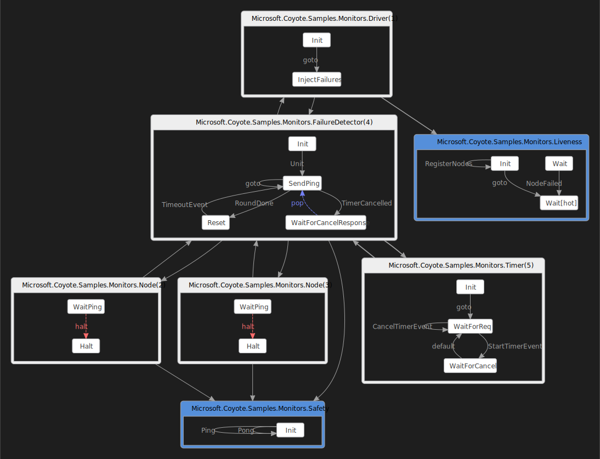

## Bug in failure detector

There is a particularly hard bug to find in the `coyote/Samples/Monitors` sample application. If you
run this application from your command prompt it will write output forever. It seems perfectly
happy, right?  But there is a bug that happens rarely, the kind of pesky bug that would keep you up
late at night scratching your head. Read further to learn how to find this bug using Coyote!

## What you will need

You will also need to:

- Install [Visual Studio 2019](https://visualstudio.microsoft.com/downloads/).
- Install the [.NET 6.0 version of the coyote tool](../../get-started/install.md).
- Be familiar with the `coyote` tool. See [using Coyote](../../get-started/using-coyote.md).
- Clone the [Coyote git repo](http://github.com/microsoft/coyote).

## Build the sample

You can build the sample by following the instructions
[here](https://github.com/microsoft/coyote/tree/main/Samples/README.md).

## Run the sample

Let's see if Coyote can find the bug in this sample. Type `coyote -?` to see the help page to make
sure you have installed it correctly. Now you are ready to run a `coyote` test as follows:

```plain
coyote test ./Samples/bin/net6.0/Monitors.dll --iterations 1000 -ms 200
```

This also runs perfectly up to 1000 iterations. So this is indeed a hard bug to find. It can be
found using the `prioritization` exploration strategy with a given maximum number of priority switch
points `--strategy prioritization` (or with the default `random` exploration strategy, but with a
much larger number of iterations, typically more than 100,000 of them).

```plain
coyote test ./Samples/bin/net6.0/Monitors.dll --iterations 1000 -ms 200 -s prioritization -sv 10
```

Even then you might need to run it a few times to catch the bug. Set `--iterations` to a bigger
number if necessary. You can also let `coyote` decide which exploration strategy to use. Just use
`--strategy portfolio` Coyote will select and run different exploration strategies for you. `coyote`
manages the portfolio to give you the best chance of revealing bugs. These strategies were developed
from real-world experience on large products in Microsoft Azure. When you use the right scheduling
strategy, you will see a bug report:

```plain
... Task 0 found a bug.
... Emitting task 0 traces:
..... Writing .\Samples\bin\net6.0\Output\Monitors.exe\CoyoteOutput\Monitors_0_0.txt
..... Writing .\Samples\bin\net6.0\Output\Monitors.exe\CoyoteOutput\Monitors_0_0.schedule
```

The `*.txt` file is the text log of the iteration that found the bug. The `*.schedule` contains the
information needed to reproduce the bug.

Finding a hard to find bug is one thing, but if you can't reproduce this bug while debugging there
is no point. So the `*.schedule` can be used with the `coyote replay` command as follows:

```plain
coyote replay ./Samples/bin/net6.0/Monitors.dll 
    .\Samples\bin\net6.0\Output\Monitors.exe\CoyoteOutput\Monitors_0_0.schedule
    
. Reproducing trace in ./Samples/bin/net6.0/Monitors.exe
... Reproduced 1 bug.
... Elapsed 0.1724228 sec.
```

Attach a debugger during replay and you can see what exactly is going wrong.

You might be wondering what the `Monitors` sample app is really doing. The `coyote` command line
tool can help you with that also. If you run the following command line it will produce a [DGML
diagram](../../how-to/generate-dgml.md) of the state machines that are being tested:

```plain
coyote test ./Samples/bin/net6.0/Monitors.dll --iterations 10 --max-steps 20 --graph
```

You will see the following output:

```plain
... Emitting graph:
..... Writing .\Samples\bin\net6.0\Output\Monitors.exe\CoyoteOutput\Monitors_0_1.dgml
```

Open the DGML diagram using Visual Studio 2019 and you will see the following:



Download the [Monitors.dgml](../../assets/images/Monitors.dgml) file to view it interactively using
Visual Studio. Make sure the downloaded file keeps the file extension `.dgml`. Use CTRL+A to select
everything and this will show you all the detailed links as well.
