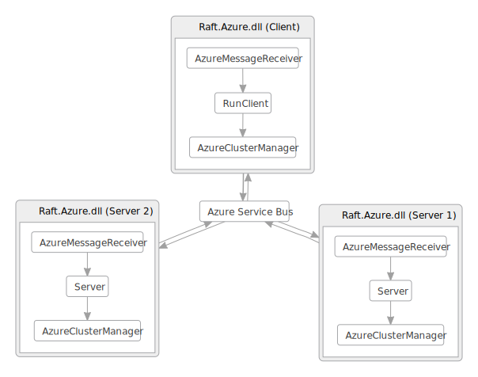
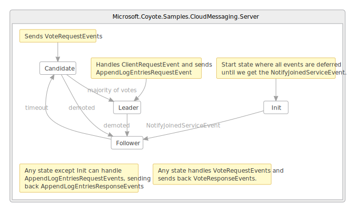

## Raft consensus protocol on Azure

The [CloudMessaging](https://github.com/microsoft/coyote-samples/tree/main/CloudMessaging) sample
implements the [Raft consensus algorithm](https://raft.github.io/) as an Azure Service built on the
[Azure Service Bus](https://azure.microsoft.com/en-us/services/service-bus/). See [animating state
machine demo](../../concepts/actors/state-machine-demo.md) which shows the Coyote
[systematic testing process](../../concepts/concurrency-unit-testing.md) in action on this application.

This example is organized into the following projects:

- **Raft** - a .NET Core C# class library that implements the [Raft Consensus
  Algorithm](https://raft.github.io/) using the Coyote [Actor Programming
  Model](../../concepts/actors/overview.md).
- **Raft.Azure** - a C# executable that shows how to run Coyote messages through an [Azure Service
  Bus](https://azure.microsoft.com/en-us/services/service-bus/).
- **Raft.Mocking** - demonstrates how to use mocks to systematically test the CloudMessaging sample
  application, in-memory on your local machine without using any Azure messaging, discussed in more
  detail in [Raft actor service (mocked)](raft-mocking.md) tutorial.
- **Raft.Nondeterminism** - demonstrates how to introduce controlled nondeterminism in your Coyote
  tests to systematically exercise corner-cases.

## What you will need

To run the Azure example, you will need an [Azure
subscription](https://azure.microsoft.com/en-us/free/). You will also need to install the [Azure
Command-line
tool](https://docs.microsoft.com/en-us/cli/azure/install-azure-cli?view=azure-cli-latest). This tool
is called the `Azure CLI`.

You will also need to:

- Install [Visual Studio 2019](https://visualstudio.microsoft.com/downloads/).
- Install the [.NET 5.0 version of the coyote tool](../../get-started/install.md).
- Clone the [Coyote Samples git repo](http://github.com/microsoft/coyote-samples).
- Be familiar with the `coyote` tool. See [Testing](../../get-started/using-coyote.md).

## Setup Azure

- Open a Developer Command Prompt for Visual Studio 2019.
- Run `powershell -f setup.ps1` to create a new Azure Resource Group called `CoyoteSamplesRG` and an
  Azure Service Bus namespace called `CoyoteSampleMessageBus`.

This script will provide the connection string you need so the sample can connect to the Azure
Service Bus. Copy the command line from the output of `setup.ps1` and paste it into your console
window:

```plain
set CONNECTION_STRING=...
```

If you need to find this connection string again later you can get it from your [Azure
Portal](http://portal.azure.com), find the message bus resource you created above, click on `Shared
access policies` and select the `RootManageSharedAccessKey` and wait for the keys to load, then copy
the contents of the field named `Primary Connection String`.

## Build the samples

Build the `coyote-samples` repo by running the following command:

```plain
powershell -f build.ps1
```

## Run the Raft.Azure application

Now you can run the Raft.Azure application:

```plain
"./bin/net5.0/Raft.Azure.exe" --connection-string "%CONNECTION_STRING%" --topic-name rafttopic --num-requests 5 --local-cluster-size 5
```

Note: you don't want to try and run Raft.Azure client using the `coyote test` tool until you
complete the [mocking](raft-mocking.md) of the Azure Message Bus calls.

## Design

The `Raft.dll` library contains a `Server` [state
machine](../../concepts/actors/state-machines.md), and a `ClusterManager` state machine. It also
contains an interface named `IServerManager` and some Coyote `Event` declarations which describe the
message types that are sent between the Server instances and the Client.


The `ClusterManager` is an abstract state machine that models the concept of being able to broadcast
messages to all `Servers` registered in a cluster. Sending an event to this cluster will result in
all `Servers` getting that same event. So, as the raft protocol requires, broadcasting
`VoteRequestEvents` can be done by a `Server` using this `SendEvent` instruction:

```csharp
    this.SendEvent(this.ClusterManager, new VoteRequestEvent(this.CurrentTerm, this.Manager.ServerId, lastLogIndex, lastLogTerm));
```

You will see similar calls sending `VoteResponseEvent`, `AppendLogEntriesRequestEvent`,
`AppendLogEntriesResponseEvent`, and `ClientResponseEvent` via the `ClusterManager`.

The second project builds `Raft.Azure.dll` and contains all the `Azure` specific code that hooks all
this up to an `Azure Service Bus`. Notice it implements the `IServerManager` interface in a class
named `AzureServer` and it subclasses the `ClusterManager` in a state machine named
`AzureClusterManager`. This subclass achieves the required broadcast semantics by forwarding all
events received to an Azure Service Bus pub/sub topic. It also has an `AzureMessageReceiver` class
which subscribes to the Azure service bus topic, and forwards those events back into the local
Coyote state machine using `SendEvent`. You can think of `AzureClusterManager` and
`AzureMessageReceiver` as an example of how to "bridge" an external messaging platform with the
Coyote runtime. In this way you can map Coyote Actors to any underlying messaging platform which is
why Coyote does not force you to use any particular message platform.

## Initialization

When you run the `Raft.Azure.dll` command line you will see some options:

| Option | Description |
| ------ | ----------- |
| `--connection-string`|your Azure Service Bus connection string|
| `--topic-name`|optional string for Service Bus Topic (default 'rafttopic')|
| `--num-servers` |number of servers to spawn|


As you can see here `Raft.Azure.dll` will launch each server in a separate process. The first
process is the `Client` process, then each subsequent one is a `Server` instance according to the
specified `--local-cluster-size` command line argument. The following diagram shows what this looks
like when we have 2 servers in the cluster:



The startup sequence for all this can be found in `Program.cs` and goes like this:

1. Parse the command line for the client process and call `RunAsync`.
2. `RunAsync` sets up the Azure Service Bus pub/sub topic using `CreateTopicAsync`, and creates a
   subscription to that topic using `CreateSubscriptionAsync`. Each process does this same thing so
   they can all talk to each other via the Azure Service Bus using the `TopicClient`.
3. Create the Coyote `IActorRuntime` using `RuntimeFactory.Create`.
3. The `TopicClient` is then wrapped by the first Coyote Actor called `AzureClusterManager`.
4. Then depending which process is running it calls `RunClient` or `RunServer`.
5. `RunClient` launches the server processes in `StartRaftServers` and special hidden command line
   arguments `--server-id` and `--client-process-id` tell those child processes to run in server
   mode.
6. `RunClient` creates an `AzureMessageReceiver`, and sends a sequence of `ClientRequestEvents`,
   waiting for a response from the cluster for each request.
7. `RunServer` creates the `AzureServer` object and an `AzureMessageReceiver`, telling the
   `AzureMessageReceiver` to run forever asynchronously. Each server terminates when the client
   terminates which is done by `MonitorClientProcess`. The `AzureServer` object creates a
   `StateMachine` of type `Server`.  **Note:** `MonitorClientProcess` doesn't work when you run the
   project from Visual Studio debugger, in that case you may have to kill the spawned `dotnet`
   processes by hand.

## Processing

The `Server` state machine is where the interesting code lives, it is a complete implementation of
the `Raft` protocol. All the `Server` instances form a fault-tolerant server cluster, that can
handle `ClientRequestEvents` in a reliable way. `Server` instances can failover, and the `cluster`
protocol is able to figure out which server should handle which client request, and how to replicate
the logs across all servers for safe keeping and reliability. The whole idea is that with this
cluster there is no single point of failure. Clearly for this to be reliable, it must also be bug
free, and therefore is an excellent candidate for thorough testing by the `coyote test` tool.

The `RunClient` method shows how you can use the `cluster`, namely, sending a `ClientRequestEvent`
and waiting for the async response that comes back from the service bus in the
`ClientResponseEvent`. Sending a message to the cluster is done like this:

```csharp
runtime.SendEvent(clusterManager, new ClientRequestEvent(command));
```

Receiving a response is done using the `ResponseReceived` event on the `AzureMessageReceiver`. The
client then uses a `TaskCompletionSource` to synchronize these two events so that it waits for a
`ClientResponseEvent` before sending the next `ClientRequestEvent`.

Each `ClientRequestEvent` goes to all server processes in the cluster via the Azure Service Bus. The
servers then implement their Raft voting protocol to figure out which server will handle the
request. The sample runs each `Server` on the same machine, just for simplicity, but in a real
fault-tolerant system you would probably want to run each server on a different VM in the cloud and
get a real distributed cluster going. You could use Kubernetes or some other system to manage that
setup. The Azure Service Bus code would be the same in either case.

The `AzureServer` code is a bit more complicated than you might expect, where it uses
`CreateActorIdFromName`, then a `Initialize` method to create the `Server` state machines and a
`Start` that sends a `NotifyJoinedServiceEvent` to kick things off. The reason for all this will
become more apparent when you look at the [mocked implementation](raft-mocking.md). In the mocking
case all `Server` state machines run in the same process and in that case the servers must not start
until all server instances have been created. This is an example of how the issue of testability can
sometimes affect how you do things in your production code.

`CreateActorIdFromName` creates only the `ActorId` object and does not actually create the actor.
This is handy when you need to give that `ActorId` to another `Actor` as part of an initialization
process. Then at a later time when everything is ready we can create the actual actor using this
predetermined `id` as follows:

```csharp
this.Runtime.CreateActor(id, typeof(Server), new Server.SetupServerEvent(this, this.ClusterManager));
```

Notice the `Server` when it is in the start state (`Init`), it defers all events using a special
wild card:

```csharp
[DeferEvents(typeof(WildCardEvent))]
```

Then only when `NotifyJoinedServiceEvent` arrives does it go to the `Follower` state where the raft
protocol begins and any queued messages can be processed.

This tutorial does not go into the gory details of the entire `Server` protocol implementation, but
there is a great animation of how the Raft Protocol works on [this
website](https://raft.github.io/). Please check that out, as it will make the `Server` code easier
to understand. This [more detailed walkthrough](http://thesecretlivesofdata.com/raft/) of the
protocol can also help make things even more clear.

The overall `Server` state machine flow looks like this:



In a nutshell, each `Server` instance can be in one of three states, `Follower`, `Candidate` or
`Leader`. Each `Server` starts in the `Follower` state. If these followers don't hear from a leader
in a small timeout period then they promote themselves to `Candidate` state where each candidate
requests a vote from the other servers in the cluster using the `VoteRequestEvent`. The other
servers figure out how to reply to those votes, either accepting or denying the request sending back
a corresponding `VoteResponseEvent`. A `Candidate` then becomes a `Leader` if it gets affirmative
votes from a majority of the `Server` nodes in the cluster. A `Leader` then appends a new entry to
the distributed log by sending an `AppendLogEntriesRequestEvent` to the other servers in the
cluster. A `AppendLogEntriesResponseEvent` is returned in response to that which includes a success
indicator. Now there are more details to this, like what happens if two servers get a majority vote
or if a `AppendLogEntriesRequestEvent` fails for some reason. The cluster does some clever book
keeping using a type of version number called "Term" where in some cases an elected `Leader` can be
rolled back to `Follower` enabling a new election process to continue and so on.

Note: a real application of this protocol could be deployed where you simply add new `[DataMember]`
fields to each `ClientRequestEvent`. These serializable members will be automatically replicated
across the Servers and you implement whatever server logic you need at the point in the `Server`
state machine where new log entries are about to be committed, if the server logic succeeds the
Coyote commit continues, otherwise it is rolled back.

## Summary

In this tutorial you learned:

1. How to hook Coyote `Actors` and `StateMachines` up to a real production ready messaging platform
   (like Azure Service Bus).
2. What it looks like to implement a real production ready algorithm like Raft in a Coyote
   `StateMachine`.
3. How the Coyote `StateMachine` declarations embedded in the code show that high level state
   machine design can be continually maintained in your code, and this way Coyote is ensuring design
   and implementation remain in sync over time.
4. How to reserve an `ActorId` before creating an `Actor` using `CreateActorIdFromName`.
5. How to great [DGML diagram](../../how-to/generate-dgml.md) of production runs by registering the
   `ActorRuntimeLogGraphBuilder`.

Now you need to be sure this `Server` protocol implementation is trustworthy, and for that you can
move on to the next tutorial: [Raft actor service (mocked)](raft-mocking.md).
