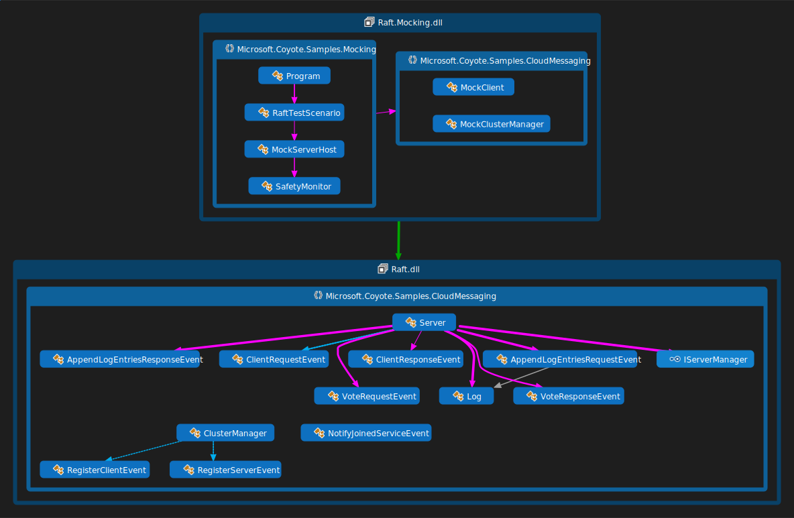

## Raft consensus protocol with mocks for testing

In the [previous example](raft-azure.md) you created an Azure application that uses Coyote and performs
messaging using [Azure Service Bus](https://azure.microsoft.com/en-us/services/service-bus/). This
is a great way to build a reliable application or service. But there is overhead in using an
enterprise scale service bus, which limits our ability to fully test the state machine.

Clearly a fault-tolerant server consensus protocol needs to be thoroughly tested, which is what you
will do in this tutorial. First you will `mock` the Azure Service Bus which allows the [Coyote
tester](../tools/testing.md) to perform thousands of tests per second and thereby find bugs
in the application code more efficiently.

Then you will use the `coyote test` tool to explore the code using different test strategies until
you achieve a high level of confidence that the code is rock solid.

## What you will need

You will also need to:

- Install [Visual Studio 2019](https://visualstudio.microsoft.com/downloads/).
- Install the [.NET Core 3.1 version of the `coyote` tool](../get-started/install.md#installing-the-net-core-31-coyote-tool).
- Clone the [Coyote Samples git repo](http://github.com/microsoft/coyote-samples).
- Be familiar with the `coyote test` tool. See [Testing](../tools/testing.md).

## Build the samples

Build the `coyote-samples` repo by running the following command:

```plain
powershell -f build.ps1
```

## Run the Raft.Mocking application

Now you can run `coyote test` tool on the Raft.Mocking application:

```plain
coyote test ./bin/net5.0/Raft.Mocking.dll -i 1000 -ms 200 --coverage activity
```

You should see the test succeed with output like this, including a coverage report and graph:
```plain
. Testing ./bin/net5.0/Raft.Mocking.dll
Starting TestingProcessScheduler in process 34068
... Created '1' testing task.
... Task 0 is using 'random' strategy (seed:1388735316).
..... Iteration #1
..... Iteration #2
..... Iteration #3
.....
..... Iteration #900
..... Iteration #1000
... Emitting coverage reports:
..... Writing .\bin\net5.0\Output\Raft.Mocking.dll\CoyoteOutput\Raft.Mocking.dgml
..... Writing .\bin\net5.0\Output\Raft.Mocking.dll\CoyoteOutput\Raft.Mocking.coverage.txt
..... Writing .\bin\net5.0\Output\Raft.Mocking.dll\CoyoteOutput\Raft.Mocking.sci
... Testing statistics:
..... Found 0 bugs.
... Scheduling statistics:
..... Explored 1000 schedules: 0 fair and 1000 unfair.
..... Hit the max-steps bound of '200' in 100.00% of the unfair schedules.
... Elapsed 61.3283634 sec.
. Done
```

Now you are seeing a longer more realistic test run.  But if you create a `--verbose` log you will
see that in these 61 seconds the test actually tested over 2.4 million async operations!!

In this case you should see `Total event coverage: 100.0%` which is a great sign, this means every
possible event has been sent and received by every state of every state machine that you tested here.
This is not the same thing as 100% code coverage, but it is a higher level of abstraction on
coverage. Both are important.

The coverage report has a separate section for each `Actor` or `StateMachine` that was covered by
the test. It then lists the overall event coverage as a percentage, then lists the details of each
`State`. For actors there will be only one state listed, matching the name of the `Actor` type.

For example, the `Server` section reports the `Candidate` state like this:

```plain
State: Candidate
    State event coverage: 100.0%
    Events received: Microsoft.Coyote.Actors.Timers.TimerElapsedEvent, AppendLogEntriesRequestEvent,
    AppendLogEntriesResponseEvent, VoteRequestEvent, VoteResponseEvent
    Events sent: AppendLogEntriesResponseEvent, VoteRequestEvent, VoteResponseEvent
    Previous states: Candidate, Follower
    Next states: Candidate, Follower, Leader
```

This shows 100% coverage for the state, meaning all expected events have been received, it lists
those under `Events received`, and it also lists all `Events sent` while in this state. Lastly it
shows all recorded state transitions in and out of this state. `Previous states` are the states
that transitions to the `Candidate` state and `Next states` are the states that the `Candidate`
state went to using `RaiseGotoStateEVent` transitions. The key thing to look for here is that
during this test run some of the `Server` state machines did make it to the `Leader` state.

Notice because of the mocking of Azure API's this application is now able to run 200 steps per
iteration and a thousand iterations pretty quickly, much faster than if all those messages were
going to Azure and back. This means the test can quickly explore every kind of asynchronous timing
of events to find all the bugs. Not only is it faster but it is also systematic in how it explores
every possible interleaving of asynchronous operations. This systematic approach ensures the test
doesn't just test the same happy paths over and over (like a stress test does) but instead it is
more likely to find one bad path where a bug is hiding.

The `--coverage` report also generates a [DGML diagram](../tools/dgml.md) of all the
messages sent during the test. You can browse these graphs using Visual Studio. The file name in
this case is `Raft.Mocking.dgml` and it will look something like this:


Here you see all the `Actor` objects in green, and `Monitor` in blue and `StateMachine` and
`ExternalCode` objects in gray. You can see that all the states were explored in the `Server`,
including the `Leader` state. The `MockStateMachineTimer` is a helper `Actor` provided as a mock
implementation `CreateTimer` and `CreatePeriodicTimer` API's.

There are many different `coyote test` command line options you can play with to test different things
and really increase your confidence level in the code you are testing. For example there are 4 different
test scheduling options you can play with:

| Option | Description |
| ------ | ----------- |
| `--sch-random` | Choose the random scheduling strategy (this is the default) |
| `--sch-pct uint` | Choose the PCT scheduling strategy with given maximum number of priority switch points |
| `--sch-fairpct uint` | Choose the fair PCT scheduling strategy with given maximum number of priority switch points |
| `--sch-portfolio` | Choose the portfolio scheduling strategy in combination with parallel testing |


These options change how `coyote test` explores the large state space of possible schedules for your
async operations. The last option is interesting because it allows you to test many different
scheduling strategies at once, this is used in combination with the `--parallel` test option, so the following,
 for example, would run 5 parallel test processes using different scheduling strategies:

```plain
coyote test ./bin/net5.0/Raft.Mocking.dll -i 1000 -ms 200 --coverage activity --sch-portfolio --parallel 5
```

When you use this the test will print the chosen strategies at the top of the test output:

```plain
... Task 3 is using 'FairPCT' strategy (seed:3922897588).
... Task 4 is using 'ProbabilisticRandom' strategy (seed:3469760925).
... Task 2 is using 'ProbabilisticRandom' strategy (seed:1642014516).
... Task 1 is using 'FairPCT' strategy (seed:1466235705).
... Task 0 is using 'Random' strategy (seed:3931672516).
```

You can also increase the number of iterations to 10,000,000 if you want to, then come back tomorrow
and see how it did. Clearly, you should now see that Coyote makes it possible to thoroughly test
your code automatically, without you having to write a million individual boring unit tests that
test every little possibility in terms of sending and receiving messages.

Manual unit testing has a place in software engineering, but what Coyote does is more powerful. With
Coyote you can explore a very large number of combinations and find lots of bugs which greatly
increases confidence in your code.

One interesting thing about Coyote is that every time you run a test you might explore a slightly
different space and so continuous integration testing where you run tests on every checkin, or
longer test suites every night, has a higher chance of finding that one ridiculously embarrassing
bug before you go live with your service. You might wonder, if there is randomness in the testing,
how will you reproduce bugs that are found? The answer lies in the random seed printed above
`(seed:3469760925)`. This is all you need to re-run an identical test, so interesting random seeds
can also become your regression test suite. Imagine, an entire interesting regression test is
simply one integer. There is one restriction to this, if the product code you are testing changes
the set of non-deterministic choices, then prior saved random seeds are no longer usable, but you
can quickly build a new set by simply running more tests. Comparing this with the cost of
maintaining large static regression test suite code bases, this is quite an improvement.

Instead of building lots of little manual unit tests, you will find that when using Coyote your time
is better spent designing interesting mocks that accurately model all the kinds of weird things that
can happen when interacting with external systems. You also should write lots of interesting
specifications throughout these mocks that use `Assert` to ensure everything is running properly
during the test. You also should use the `Monitor` pattern to ensure all the global invariants you
care about in your system remain true no matter what a specific test run is doing.

## Design

The following diagram illustrates how the `MockClient` actor sends `ClientRequestEvents`, and how
the `MockClusterManager` subclasses from `ClusterManager`. There is also a `MockServerHost` that
implements the `IServerManager` interface and a `RaftTestScenario` class which sets everything up.
Notice that the `Server` code you are testing here is the exact same production ready code you used
in the [Raft actor service (on Azure)](raft-azure.md) tutorial.  You should now see that this is **very
cool**. You have switched the `Server` from running on Azure to running locally with a bunch of
mocks and didn't have to change one line of `Server` code.

 

For this test we also inject a `SafetyMonitor` into the process by simply registering it on the
runtime like this:

```c#
runtime.RegisterMonitor<SafetyMonitor>();
```

This enables the monitor so that when the `MockServerHost` sends the `NotifyLeaderElected`
it can keep track and make sure there is only one leader per term.

The `MockClusterManager` implementation is very simple, since at test time all `Server` instances
are in the same process, a broadcast operation is simply a for-loop over those servers, sending the
broadcast event to each one using `SendEvent`.

The `MockServerHost` is a bit tricky, since all the `Server` actors have to be created before you
start them using the `NotifyJoinedServiceEvent` otherwise the  `MockClusterManager` might be too
quick and start sending events to a `Server` instance before it is ready. Now you can see why the
`IServerManager` interface was designed this way in the original Raft.Azure example.

The `RaftTestScenario` then creates all the actors needed to run the test including all the mock
actors and the real `Server` instances. This is all relatively simple compared to the original
Raft.Azure example that was also dealing with setting up the Azure Service Bus.

This mock test setup is able to fully test the `Server` implementation and get good coverage. The
`IServerManager` interface and the abstract `ClusterManager` state machine where originally designed
with testability in mind and that's what makes this easy mocking of the external pieces possible.

The test also includes a coyote `Monitor` called `SafetyMonitor` which provides a global invariant
check, namely checking there is never more than one `Server` that is elected to be the `Leader` at
the same time. The `Monitor` class in Coyote shows how to inject additional work that you want to do
at test time only, and have almost no overhead in the production code. Hopefully you agree it is
pretty easy to create a monitor and that monitoring like this is a powerful concept that adds
a lot of value to your Coyote testing process.

## Summary

In this tutorial you learned:

1. How to mock external systems like Azure Service Bus to make a Coyote test run fast.

2. How to use the `coyote test` command line to explore different test strategies.

3. How to read a Coyote coverage report and view the coverage graph.

4. How to inject test logic like the `SafetyMonitor` in to the `coyote test` scenario that monitors
   the overall correctness of your system in a way that has minimal overhead in your production
   code.

5. How to think about model based testing using random seeds and integrate that into your continuous
   integration testing process.

You can also explore the `Raft.Nondeterminism.dll` version of this sample that injects a bug in the
system by randomly sending duplicate `VoteRequestEvents`. Then you can see how the `coyote test`
tool is able to spot the resulting bugs because of the `SafetyMonitor`.
