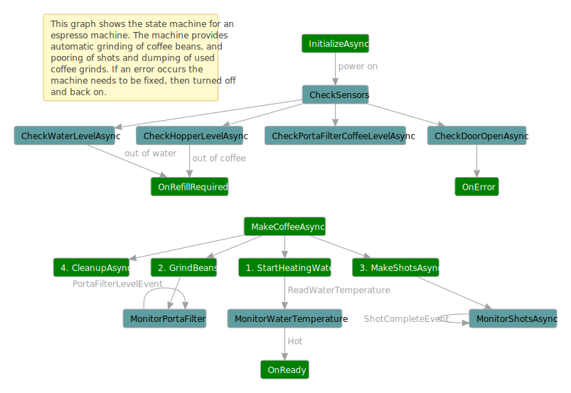

## Test failover and liveness

*Wikipedia* provides this [definition](https://en.wikipedia.org/wiki/Failover): "**Failover** is
switching to a redundant or standby computer server, system, hardware component or network upon the
failure or abnormal termination of the previously active application, server, system, hardware
component, or network. Systems designers usually provide failover capability in servers, systems or
networks requiring near-continuous availability and a high degree of reliability."

This sample applies the failover concept to the firmware of an automated espresso machine using the
Coyote [asynchronous tasks](../concepts/tasks/overview.md) programming model. Imagine what
would happen if the tiny CPU running the machine rebooted in the middle of making a coffee. What
bad things might happen? Can we design a code that can handle this scenario and provide a more fault
tolerant coffee machine?

An identical version of this tutorial is also available that uses the coyote [asynchronous
actors](actors/test-failover.md) programming model.

The following diagram shows how Coyote can be used to test this scenario and help you design more
reliable software.


The `CoffeeMachine` is modeled as an asynchronous interface using
[controlled Tasks](../concepts/tasks/overview.md). This example it not providing real
firmware, instead it `mocks` the hardware sensor platform built into the machine. This is done in
the asynchronous `MockSensors` class. This class provides async ways of reading sensor values like
the water temperature and setting things like the power button, or turning on and off the coffee
grinder and so on.

The reason we are using an asynchronous design is that even in the smallest of devices, often times
there is a message passing architecture where different hardware components are connected via some
sort of bus, whether it is a simple serial port, or something more sophisticated like a [CAN
bus](https://en.wikipedia.org/wiki/CAN_bus).

We will test that we can kill the `CoffeeMachine` and restart it without anything bad happening.
This test is setup by the `FailoverDriver`. The FailoverDriver lets the first `CoffeeMachine`
instance run for a bit then it randomly kills it by using the `TerminateAsync` method, then it
starts a new `CoffeeMachine`. The new `CoffeeMachine` instance needs to figure out the state of the
sensors such that when a `MakeCoffeeEvent` arrives, it doesn't do something silly that breaks the
machine. The `MockSensors` class is not killed so that it acts as a persistent store for sensor state
across all instances of the `CoffeeMachine`.

Some safety `Asserts` are placed in the code that verify certain important things, including:
- do not turn on heater if there is no water
- do not turn on grinder if there are no beans in the hopper
- do not turn on shot maker if there is no water

There is also a correctness assert in the `CoffeeMachine` to make sure the correct number of
espresso shots are made and there is a `LivenessMonitor` that monitors the `CoffeeMachine` to make
sure it never gets stuck, i.e., it always finishes the job it was given or it goes to an error state
if the machine needs to be fixed. See [Liveness Checking](../how-to/liveness-checking.md).

A number of excellent bugs were found by Coyote during the development of this sample, and this
illustrates the fact that Coyote can be applied to any type of asynchronous software, not just cloud
services. There is still one bug remaining in the code which you can find using `coyote test`, and
it happens after failover just to prove the usefulness of this testing methodology.

## What you will need

To run the `CoffeeMachine` example, you will need to:

- Install [Visual Studio 2019](https://visualstudio.microsoft.com/downloads/).
- Install the [.NET 5.0 version of the coyote tool](../get-started/install.md).
- Clone the [Coyote Samples git repo](http://github.com/microsoft/coyote-samples).
- Be familiar with the `coyote` tool. See [using Coyote](../get-started/using-coyote.md).

## Build the samples

Build the `coyote-samples` repo by running the following command:

```plain
powershell -f build.ps1
```

## Run the failover coffee machine application

Now you can run the `CoffeeMachine` application:

```plain
"./bin/net5.0/CoffeeMachineTasks.exe"
```

## The Coffee Machine

There are many different types of coffee machines. This example is based on the following machine
which can automatically heat water, grind beans, and make an espresso shot all with the press of a
button:


The following diagram shows the abstract state machine that is implemented in C# code:



Run the executable without using `coyote test` (this is called running in `production mode`), you
will see the following console output. Notice in the output below that the `FailoverDriver` forces
the termination of the `CoffeeMachine` right in the middle of making a coffee. Then when the
`CoffeeMachine` is restarted, the `FailoverDriver` requests another coffee and the `CoffeeMachine`
is able to continue on, the water is already warm, and it dumps the old grinds so you have the
freshest possible coffee each time.

```xml
<FailoverDriver> #################################################################
<FailoverDriver> starting new CoffeeMachine iteration 0.
<CoffeeMachine> initializing...
<CoffeeMachine> checking initial state of sensors...
<CoffeeMachine> Water level is 23 %
<CoffeeMachine> Hopper level is 85 %
<CoffeeMachine> Warming the water to 100 degrees
<CoffeeMachine> Turning on the water heater
<CoffeeMachine> Coffee machine is warming up (71 degrees)...
<CoffeeMachine> Coffee machine is warming up (81 degrees)...
<CoffeeMachine> Coffee machine is warming up (91 degrees)...
<CoffeeMachine> Coffee machine water temperature is now 100
<CoffeeMachine> Coffee machine water temperature is now 100
<CoffeeMachine> Coffee machine is ready to make coffee (green light is on)
<CoffeeMachine> Turning off the water heater
<CoffeeMachine> Coffee machine is ready to make coffee (green light is on)
<CoffeeMachine> Coffee requested, shots=2
<CoffeeMachine> Grinding beans...
<CoffeeMachine> PortaFilter is 10 % full
<CoffeeMachine> PortaFilter is 20 % full
<CoffeeMachine> PortaFilter is 30 % full
<FailoverDriver> forcing termination of CoffeeMachine.
<CoffeeMachine> Coffee Machine Terminating...
<CoffeeMachine> Dumping the grinds!
<CoffeeMachine> #################################################################
<CoffeeMachine> # Coffee Machine Halted                                         #
<CoffeeMachine> #################################################################
<CoffeeMachine>
<FailoverDriver> #################################################################
<FailoverDriver> starting new CoffeeMachine iteration 1.
<CoffeeMachine> initializing...
<CoffeeMachine> checking initial state of sensors...
<CoffeeMachine> Water level is 22 %
<CoffeeMachine> Hopper level is 38 %
<CoffeeMachine> Warming the water to 100 degrees
<CoffeeMachine> Coffee machine water temperature is now 100
<CoffeeMachine> Coffee machine is ready to make coffee (green light is on)
<CoffeeMachine> Coffee requested, shots=3
<CoffeeMachine> Grinding beans...
<CoffeeMachine> PortaFilter is 10 % full
<CoffeeMachine> PortaFilter is 20 % full
<CoffeeMachine> PortaFilter is 30 % full
<CoffeeMachine> PortaFilter is 40 % full
<CoffeeMachine> PortaFilter is 50 % full
<CoffeeMachine> PortaFilter is 60 % full
<CoffeeMachine> PortaFilter is 70 % full
<CoffeeMachine> PortaFilter is 80 % full
<CoffeeMachine> PortaFilter is 90 % full
<CoffeeMachine> PortaFilter is full
<CoffeeMachine> Making shots...
<CoffeeMachine> Shot count is 0
<CoffeeMachine> Shot count is 1
<CoffeeMachine> 2 shots completed and 2 shots requested!
<CoffeeMachine> Dumping the grinds!
<FailoverDriver> CoffeeMachine completed the job.
...
```

You will not see this exact output because the test injects some randomness.

The test will continue on making coffee until it runs out of either water or coffee beans and the
`FailoverDriver` halts each `CoffeeMachine` instance at random times until the machine is out of
resources, at which point the test is complete. The `MockSensors` also randomly choose some error
conditions, so instead of the above you may see some errors like:

```xml
<CoffeeMachine> Cannot safely operate coffee machine with the door open!
<CoffeeMachine> Coffee machine needs manual refilling of water and/or coffee beans!
```

If you see these errors, just press ENTER to terminate the program and run it again. These random
start conditions just help the test cover more cases.

Each halted machine is terminated and discarded, then a new `CoffeeMachine` instance is started.
Each new `CoffeeMachine` instance must figure out what is happening with the sensors and make the
next coffee without incident. Eventually a `CoffeeMachine` will report there is no more water or
coffee beans and then it will stop with an error message saying the machine needs to be manually
refilled.

## Coyote testing

You can now use [coyote test](../get-started/using-coyote.md) to exercise the code and see if any
bugs can be found. From the `coyote-samples` folder.  First you need to rewrite the assembly:

```plain
coyote rewrite ./bin/net5.0/CoffeeMachineTasks.dll
```

Then you can run the test:

```plain

coyote test ./bin/net5.0/CoffeeMachineTasks.dll -i 1000 -ms 500 --sch-fairpct 10
```

Chances are this will find a bug quickly, one of the safety assertions will fire and you will see
that a test output log is produced, like this:

```plain
.\bin\net5.0\Output\CoffeeMachineTasks.exe\CoyoteOutput\CoffeeMachine_0_0.txt
```

This log contains only the one test iteration that failed, and towards the end you will see
something like this:

```xml
<ErrorLog> Please do not turn on grinder if there are no beans in the hopper
```

So the `CoffeeMachine` accidentally tried to grind beans when the hopper was empty.

In the log you will see that the `FailoverDriver` has halted `CoffeeMachine` once or twice then the
new `CoffeeMachine` instance which made it all the way to `Grinding beans` where it tripped the
safety assert in `MockSensors`. So the bug here is that somehow, the second `CoffeeMachine` instance
missed the fact that it was low on coffee beans. A bug exists in the code somewhere. Can you find
it?

It is not a trivial bug because the `CheckSensors` state is clearly checking the coffee level by
sending the `ReadHopperLevelEvent` to the `MockSensors` actor and `CheckInitialState` does not
advance to the `HeatingWater` state until this reading is returned. So what happened?

Hint: if you search backwards in the output log you will find the following situation reported:

```xml
<CoffeeMachine> Hopper level is -54 %
```

The first `CoffeeMachine` instance left the grinder running a bit too long, and the sensor got
confused thinking the coffee level is negative. The new `CoffeeMachine` instance never thought
about this situation and checked only:

```csharp
if ((int)this.HopperLevel.Value == 0)
...
```

And so it missed the fact it might be negative. The fix is easy, just change this condition to `<=`
and the bug goes away. The fact that such a bug was found shows the usefulness of the failover
testing strategy.

### Testing the scheduling of highly asynchronous operations

This raises a bigger design question, how did the coffee level become negative?  In firmware it is
common to poll sensor readings and do something based on that. In this case we are polling a
`PortaFilterCoffeeLevelEvent` in a tight loop while in the `GrindingBeans` state. Meanwhile the
`MockSensors` class has a `ControlledTimer` running and when `MonitorGrinder` is called it decreases
the coffee level by 10 percent during every time interval. So we have a very asynchronous operation
going on here. Coffee level is decreasing based on a timer, and the `CoffeeMachine` is monitoring
that coffee level using async events. This all seems to work perfectly in the production code where
we see this output:

```xml
<CoffeeMachine> Grinding beans...
<CoffeeMachine> PortaFilter is 10 % full
<CoffeeMachine> PortaFilter is 20 % full
<CoffeeMachine> PortaFilter is 30 % full
<CoffeeMachine> PortaFilter is 40 % full
<CoffeeMachine> PortaFilter is 50 % full
<CoffeeMachine> PortaFilter is 60 % full
<CoffeeMachine> PortaFilter is 70 % full
<CoffeeMachine> PortaFilter is 80 % full
<CoffeeMachine> PortaFilter is 90 % full
<CoffeeMachine> PortaFilter is full
```

And the reason it works is because your Operating System is scheduling both of these async threads
in a way that is relatively `fair` meaning one does not run for a long time without the other being
scheduled also. But what if these two systems were running in a distributed world and one of them
hangs for a long time? This is the kind of thread scheduling that `coyote test` is testing where one
set of async tasks can run way ahead of the others.

You need to take this into account when using timer based async events. One way to improve the
design in a firmware based system like a coffee machine is to switch from a polling based system to
an interrupt based system where the `MockSensors` can send important events to the `CoffeeMachine`.
This style of `interrupt` based eventing is used to model the `ShotCompleteEvent`, `WaterHotEvent`,
`WaterEmptyEvent` and `HopperEmptyEvent`.

This shows how Coyote can help find actual design flaws in your code so you can design a system that
is more robust in the face of unexpected faults. The `coyote test` engine provides several different
`scheduling strategies` that test different kinds of fairness algorithms. These are designed to find
different kinds of bugs. The following command line shows how to use `--sch-portfolio` and the
`--parallel` options to test a bunch of different strategies in parallel, each in different test
processes:

```plain
coyote test ./bin/net5.0/CoffeeMachineTasks.dll -i 1000 -ms 500 --sch-portfolio --parallel 8
```

which outputs the following:

```plain
. Testing .\bin\net5.0\CoffeeMachineTasks.dll
Starting TestingProcessScheduler in process 42036
... Created '8' testing tasks.
... Task 3 is using 'FairPCT' strategy (seed:2143).
... Task 5 is using 'FairPCT' strategy (seed:3489).
... Task 2 is using 'ProbabilisticRandom' strategy (seed:1470).
... Task 7 is using 'FairPCT' strategy (seed:4835).
... Task 0 is using 'Random' strategy (seed:124).
... Task 6 is using 'ProbabilisticRandom' strategy (seed:4162).
... Task 4 is using 'ProbabilisticRandom' strategy (seed:2816).
... Task 1 is using 'FairPCT' strategy (seed:797).
...
```

The `--parallel 8` option means use 8 test processes in parallel, each one is assigned a random
scheduling strategy. Each process runs until the first one finds a bug, then they are all terminated
and the bug is reported. This can be useful when you want to leverage the full power of your
computer to find those bugs that are particularly hard to find more quickly.

### Liveness monitor

As described in the documentation on [Liveness Checking](../how-to/liveness-checking.md) the
`CoffeeMachine` must also eventually `finish` what it is doing. It must either make a coffee when
requested and return to the `Ready` state, or it must find a problem and go to the `Error` state or
the `RefillRequired` state. This "liveness" property can be enforced using a very simple
`LivenessMonitor` as shown below:

```csharp
internal class LivenessMonitor : Monitor
{
    public class BusyEvent : Event { }

    public class IdleEvent : Event { }

    [Start]
    [Cold]
    [OnEventGotoState(typeof(BusyEvent), typeof(Busy))]
    [IgnoreEvents(typeof(IdleEvent))]
    private class Idle : State { }

    [Hot]
    [OnEventGotoState(typeof(IdleEvent), typeof(Idle))]
    [IgnoreEvents(typeof(BusyEvent))]
    private class Busy : State { }
}
```

This type of `Monitor` is also a special kind of limited [state
machine](../concepts/actors/state-machines.md). The `CoffeeMachine` can send
events to this monitor to tell it when it has switched into `Busy` state or `Idle` state. When the
`CoffeeMachine` starts heating water, or making coffee it sends this event:

```csharp
Specification.Monitor<LivenessMonitor>(new LivenessMonitor.BusyEvent());
```

and when the `CoffeeMachine` is done making coffee or it has moved to an error state it sends this
event:

```csharp
Specification.Monitor<LivenessMonitor>(new LivenessMonitor.IdleEvent());
```

The `Busy` state is marked as a `[Hot]` state and the `Idle` state is marked as a `[Cold]` state.
During testing if `coyote test` finds the `LivenessMonitor` to be stuck in the `[Hot]` state too
long it raises an exception and the test fails.

### Reliable termination handshake

You may notice in the code that when the `FailoverDriver` wants to stop the first `CoffeeMachine` it
calls `TerminateAsync` and waits for this async task to complete before it starts a new
`CoffeeMachine`.

This may seem a bit convoluted but you can't just create a new  `CoffeeMachine` hoping the old one
would be garbage collected because this would lead to confusion in the `MockSensors` class which was
written to expect one and only one client `CoffeeMachine` at a time. The `TerminateAsync` handshake
solves that problem.

## Summary

Failover testing is simple to achieve using Coyote and yields many interesting bugs in your code,
including some thought provoking design bugs. The technique of halting your "production" objects,
and recreating them by reading from a "persistent" mock (which is not halted during testing) can be
generalized to many other scenarios (e.g. cloud services) where someone needs to test failover logic
of production code using Coyote.

In this tutorial you learned:

1. How to do failover testing in the Coyote controlled `Task` programming model.
2. How to use Coyote in a firmware/sensor scenario.
3. How to use `--sch-portfolio` testing on multiple processes to find tricky bugs more quickly.
4. How `Assert` helps find violations of safety properties during testing.
5. How to write a `LivenessMonitor`.
